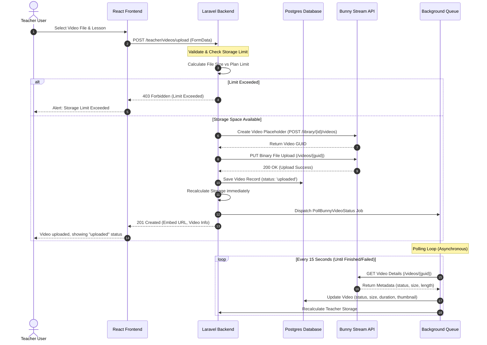

# Bunny Stream Integration Report

This document outlines the architecture, database schema changes, services, API endpoints, frontend components, security practices, background jobs, and complete flow of the Bunny Stream integration for the **Khotwt** platform.

---

## 1. Overview & Architecture

The integration allows teachers to upload educational videos directly to the platform. The backend securely handles the upload to Bunny Stream, tracks storage usage per teacher, monitors encoding status via asynchronous background jobs, and enforces storage limits according to the teacher's subscription plan.

### System Architecture Flow Diagram



---

## 2. Database Migrations

A database migration was implemented to add Bunny Stream metrics and tracking fields to both the `users` (which represents teachers when `role = 'teacher'`) and `videos` tables.

### Migration File: `2026_06_26_100000_add_bunny_stream_columns.php`

```php
<?php

use Illuminate\Database\Migrations\Migration;
use Illuminate\Database\Schema\Blueprint;
use Illuminate\Support\Facades\Schema;

return new class extends Migration
{
    public function up(): void
    {
        Schema::table('users', function (Blueprint $table) {
            if (!Schema::hasColumn('users', 'bunny_storage_used_gb')) {
                $table->decimal('bunny_storage_used_gb', 10, 4)->default(0.0000);
            }
            if (!Schema::hasColumn('users', 'bunny_storage_limit_gb')) {
                $table->decimal('bunny_storage_limit_gb', 10, 4)->default(10.0000);
            }
        });

        Schema::table('videos', function (Blueprint $table) {
            if (!Schema::hasColumn('videos', 'bunny_video_id')) {
                $table->string('bunny_video_id')->nullable();
            }
            if (!Schema::hasColumn('videos', 'bunny_thumbnail_url')) {
                $table->string('bunny_thumbnail_url')->nullable();
            }
            if (!Schema::hasColumn('videos', 'bunny_duration')) {
                $table->integer('bunny_duration')->default(0);
            }
            if (!Schema::hasColumn('videos', 'bunny_size_bytes')) {
                $table->bigInteger('bunny_size_bytes')->default(0);
            }
            if (!Schema::hasColumn('videos', 'bunny_status')) {
                $table->string('bunny_status')->default('queued'); // queued, processing, finished, failed, uploaded
            }
        });
    }

    public function down(): void
    {
        Schema::table('users', function (Blueprint $table) {
            $table->dropColumn(['bunny_storage_used_gb', 'bunny_storage_limit_gb']);
        });

        Schema::table('videos', function (Blueprint $table) {
            $table->dropColumn(['bunny_video_id', 'bunny_thumbnail_url', 'bunny_duration', 'bunny_size_bytes', 'bunny_status']);
        });
    }
};
```

---

## 3. Services

### 3.1. Bunny Stream Service Layer: `App\Services\BunnyStreamService.php`

Handles all direct HTTP interactions with Bunny Stream API, validates storage space before uploads, and computes used/total storage sizes dynamically.

* **Main methods:**
  - `createVideo(string $title)`: Creates a video object/GUID on Bunny Stream.
  - `uploadVideo(string $videoId, string $filePath)`: Streams a file to Bunny Stream.
  - `getVideoDetails(string $videoId)`: Fetches metadata (length, status, size).
  - `deleteVideo(string $videoId)`: Removes a video from Bunny Stream.
  - `recalculateStorage(int $teacherId)`: Recalculates storage in GB and updates both `users` and `teacher_subscriptions` tables.
  - `isStorageLimitExceeded(int $teacherId, int $newFileSizeBytes)`: Checks if an upload fits in the remaining space of the subscription tier.

### 3.2. Background Polling Job: `App\Jobs\PollBunnyVideoStatus.php`

Polls Bunny Stream API sequentially (every 15 seconds) using a queued process until the status changes from `processing` or `uploaded` to `finished` or `failed`. Recalculates teacher storage upon each success.

---

## 4. API Endpoints

### 4.1. Teacher Endpoints
* **`POST /teacher/videos/upload`**:
  Uploads a video to the backend, forwards it to Bunny Stream, saves it as `uploaded` in the DB, and dispatches the polling job.
* **`POST /teacher/videos/{video}/replace`**:
  Replaces an existing video file by deleting the old one on Bunny Stream, uploading the new file, resetting status to `uploaded`, and spawning a polling job.
* **`DELETE /teacher/videos/{id}`**:
  Deletes the video from Bunny Stream and the local DB, immediately recalculating storage usage.
* **`GET /teacher/storage`**:
  Returns storage usage stats: used GB, limit GB, remaining GB, and percentage.
* **`GET /teacher/videos`**:
  Returns all videos belonging to the authenticated teacher with current status and sizes.

### 4.2. Admin Endpoints
* **`GET /admin/bunny/dashboard`**:
  Exposes global statistics: total storage size in bytes/GB, storage usage and subscription details per teacher, largest videos, and top storage consumers.

---

## 5. Subscription Plans Integration

Plan limits are enforced and configured globally based on the standard subscription plans:
1. **Starter Plan** ➡️ 10 GB Storage Limit
2. **Basic Plan** ➡️ 25 GB Storage Limit
3. **Pro Plan** ➡️ 50 GB Storage Limit
4. **Academy Plan** ➡️ 100 GB Storage Limit

Any additional space acquired through storage addons is added to the limit:
$$\text{Total Storage Limit} = \text{Plan Limit} + \text{Addons Limit}$$

---

## 6. Security Rules Enforced

1. **Bunny Credentials Protection**:
   All operations with Bunny Stream occur server-side. The API Key, Library ID, and pull zone domain are **never exposed to the client**.
2. **Resource Isolation**:
   Videos are queried through relationships tied to the authenticated user's teacher courses (`whereHas('lesson.unit.course', where teacher_id = current_user)`). Teachers can **never view, replace, or delete** another teacher's videos.

---

## 7. Frontend Components

1. **Teacher Video Manager (`frontend/src/pages/teacher/VideosManager.tsx`)**:
   - A fully responsive Arabic RTL control panel.
   - Shows dynamic storage consumption cards (progress bar, colors transition to orange/red as limits are approached).
   - Allows choosing Course ➡️ Unit ➡️ Lesson hierarchically to assign video uploads.
   - Shows processing statuses (`Processing`, `Finished`, `Failed`) dynamically.
   - Facilitates copying embed links, replacing video binaries, and deleting videos.
2. **Admin Bunny Dashboard (`frontend/src/pages/admin/BunnyDashboard.tsx`)**:
   - Global reports dashboard for site admins.
   - Shows total bandwidth, top consumers, and a list of the largest files for cost control.
   - Lists storage percentage consumption for every teacher with search filters.
3. **Navigation Links**:
   - Integrated links for "إدارة الفيديوهات" in the teacher navigation block.
   - Integrated links for "إحصائيات Bunny" in the admin dashboard navigation block.

---

## 8. Environment Variables Required

Add these variables to your `.env` configuration files:

```env
# Bunny Stream Core Credentials
BUNNY_LIBRARY_ID=your_library_id
BUNNY_API_KEY=your_bunny_api_key

# CDN Delivery Settings (Optional, falls back to iframe.mediadelivery.net)
BUNNY_PULL_ZONE=your_bunny_pull_zone_hostname
```
