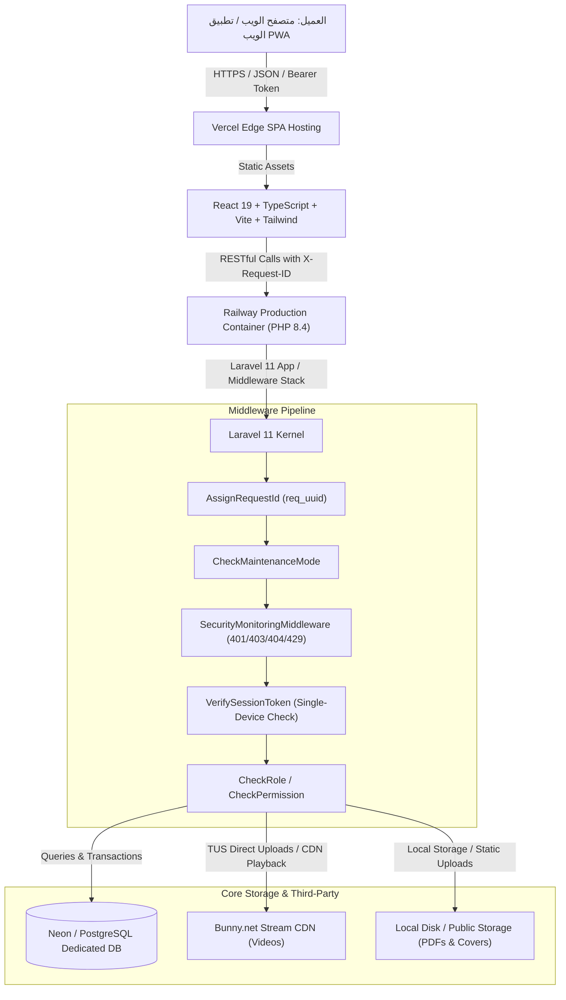
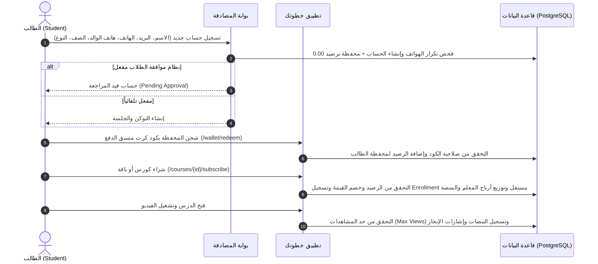
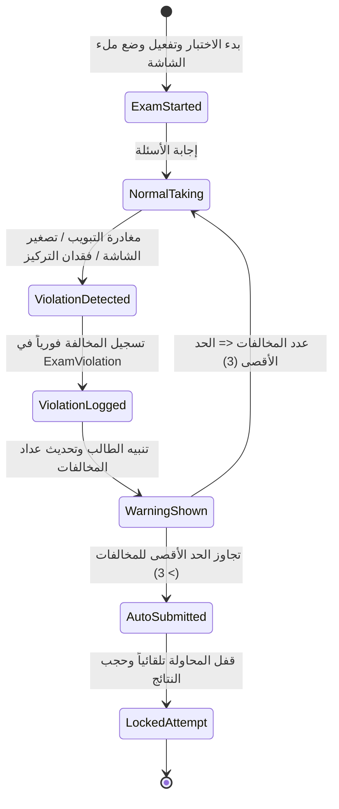
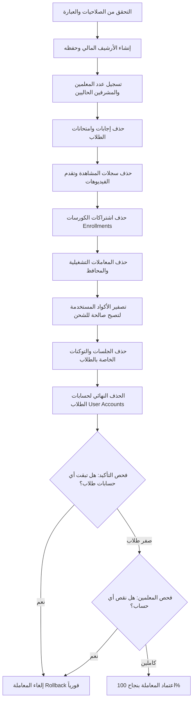

# Khotwt Platform — Master Design & Technical Blueprint
**الاسم بالعربية**: منصة خطوتك التعليمية (سابقاً: منصة علم)  
**Platform Name**: Khotwt Educational Platform  
**Repository**: `https://github.com/bebo2646/khotwt-platform`  
**Current Version**: `v2.4.0-production`  
**Documentation Date**: 2026-09-06  
**Architecture Status**: Server-First (Laravel 11 + React 19 + PostgreSQL)  
**Last Verified Git Commit**: `a326b0827557b54118def96f83bdb291f29d5935` (Commit `a326b08`)  
**Last Verification Timestamp**: 2026-09-06T03:16:00+03:00  

---

## فهرس المحتويات (Table of Contents)
1. [Platform History & Evolution](#section-1--platform-history--evolution)
2. [Current Production Architecture](#section-2--current-production-architecture)
3. [Authentication & Authorization](#section-3--authentication--authorization)
4. [Users & Roles Architecture](#section-4--users--roles-architecture)
5. [Student Subsystem Lifecycle](#section-5--student-subsystem-lifecycle)
6. [Teacher Subsystem & LMS](#section-6--teacher-subsystem--lms)
7. [Admin Control Center](#section-7--admin-control-center)
8. [Course Architecture & Catalog](#section-8--course-architecture--catalog)
9. [Course Bundle System (Independent Product Model)](#section-9--course-bundle-system-independent-product-model)
10. [Assessments, Quizzes & Monthly Exams](#section-10--assessments-quizzes--monthly-exams)
11. [Anti-Cheat & Proctoring Engine](#section-11--anti-cheat--proctoring-engine)
12. [Student Activity Monitoring & Heartbeat System](#section-12--student-activity-monitoring--heartbeat-system)
13. [Defensive Security Monitoring & Brute-Force Rate Limiting](#section-13--defensive-security-monitoring--brute-force-rate-limiting)
14. [Financial System & Double-Entry Accounting Ledger](#section-14--financial-system--double-entry-accounting-ledger)
15. [Teacher SaaS & Subscription Plans](#section-15--teacher-saas--subscription-plans)
16. [Dynamic Platform Taxonomy](#section-16--dynamic-platform-taxonomy)
17. [New Academic Year Reset Architecture](#section-17--new-academic-year-reset-architecture)
18. [Database Blueprint & Entity-Relationship Schema](#section-18--database-blueprint--entity-relationship-schema)
19. [API Blueprint & Route Registry](#section-19--api-blueprint--route-registry)
20. [Frontend Route & Page Architecture](#section-20--frontend-route--page-architecture)
21. [Codebase & Directory Topology](#section-21--codebase--directory-topology)
22. [Environment Configuration & Deployment Pipeline](#section-22--environment-configuration--deployment-pipeline)
23. [Automated Verification & Test Suites](#section-23--automated-verification--test-suites)
24. [Historical Incidents, Regressions & Lessons Learned](#section-24--historical-incidents-regressions--lessons-learned)
25. [Core Product & Non-Negotiable Business Rules](#section-25--core-product--non-negotiable-business-rules)
26. [Mobile & Android APK Readiness Analysis](#section-26--mobile--android-apk-readiness-analysis)
27. [Step-by-Step Platform Rebuild Blueprint](#section-27--step-by-step-platform-rebuild-blueprint)
28. [Known Technical Limitations & Technical Debt](#section-28--known-technical-limitations--technical-debt)
29. [Platform Changelog (June – September 2026)](#section-29--platform-changelog-june--september-2026)
30. ["DO NOT BREAK THIS" Core Guardrails](#section-30--do-not-break-this-core-guardrails)
31. [Instructions & Protocols for AI Coding Agents](#section-31--instructions--protocols-for-ai-coding-agents)

---

## SECTION 1 — PLATFORM HISTORY & EVOLUTION

### 1.1 النشأة وبداية المشروع (Project Genesis)
- **تاريخ الإطلاق الأولي**: 24 يونيو 2026 (Commit `35f9b3c` — "Initial deployment").
- **الاسم الأولي**: منصة علم (`manst ellem` / `elm-platform.com`). تم تحديث الهوية لاحقاً إلى **خطوتك (Khotwt Platform)**.
- **الهدف التأسيسي**: بناء منصة تعليمية إلكترونية مصرية متكاملة لطلاب المراحل الإعدادية والثانوية، تجمع بين نظام إدارة التعلم للمدرسين (Teacher LMS)، بيئة تعلم تفاعلية للطلاب (Student Portal)، واشتراكات SaaS للمدرسين مع تخزين الفيديو وبثه عبر سحابة Bunny.net.

### 1.2 الخط الزمني للمحطات الجوهرية (Historical Milestones)

| التاريخ | المعرف (Commit) | الميزة أو التحول المعماري | الهدف والدافع التقني | الحالة اليوم |
| :--- | :--- | :--- | :--- | :--- |
| **2026-06-24** | `35f9b3c` | التأسيس المبدئي (Initial Deployment) | إطلاق الهيكل الأساسي للكورسات، الوحدات، الدروس، الامتحانات، والمحافظ | **معدل ومطور** |
| **2026-06-24** | `ca96d65` | فرض الجلسة الواحدة (Single-Device Login) | حماية المحتوى من مشاركة الحسابات عبر توليد `session_token` فريد | **مستمر ونشط** |
| **2026-06-26** | `8579310` | تكامل Bunny Stream | الانتقال من مشغل يوتيوب فقط إلى رفع وبث الفيديو السحابي المشفر عبر Bunny.net TUS | **مستمر ونشط** |
| **2026-06-28** | `d8c25ac` | إعادة هيكلة طبقة الخدمات (Backend Service Layer) | فصل المنطق التجاري عن الـ Controllers واستخراج خدمات متخصصة | **مستمر ونشط** |
| **2026-07-01** | `b2cbe7a` | حل مشكلة قفل التمرير وتعتيم الشاشة | إلغاء `backdrop-blur-sm` الشامل الذي كان يجمد تصفح المستخدمين | **مستقر** |
| **2026-07-05** | `ed99459` | وضع الصيانة الاحترافي (Real-time Maintenance Mode) | إمكانية إيقاف المنصة للصيانة وتجاوز المشرفين الكبار عبر شارة خاصة | **مستمر ونشط** |
| **2026-07-08** | `4ce6a2c` | تصنيف التعليم: سنتر vs أونلاين | تمييز الكورسات الموجهة لطلاب السنتر عن طلاب المنصة الإلكترونية ونسب الأرباح | **مستمر ونشط** |
| **2026-07-10** | `044500` | شيت البابل شيت وجدولة الامتحانات | تمكين المعلمين من إنشاء امتحانات مؤقتة ومجدولة زمنيًا بنظام بابل شيت | **مستمر ونشط** |
| **2026-07-11** | `b23f988` | دفتر الأستاذ المحاسبي (Double-Entry Financial Ledger) | تدقيق أرباح المنصة ومستحقات المدرسين وسجلات العمليات المالية والخصومات | **مستمر ونشط** |
| **2026-07-12** | `is_bundle` | إطلاق الكورسات المجمعة (Initial Bundles) | تقديم عروض تشمل مجموعة كورسات بسعر موحد مع حفظ الوحدات المسطحة | **تمت إعادة هيكلته** |
| **2026-08-23** | `eeb6cf6` | خدمة تهيئة العام الدراسي الجديد (Year Reset) | حذف بيانات الطلاب بشكل دائم مع أرشفتهم ماليًا والحفاظ على المعلمين والمقررات | **مستمر ونشط** |
| **2026-08-23** | `772159a` | تمييز أخطاء الدخول ودعم رقم الطالب | دعم الدخول بالبريد أو رقم الهاتف المعتمد وفصل خطأ "الحساب غير موجود" عن كلمة المرور | **مستمر ونشط** |
| **2026-08-30** | `a875df6` | الامتحانات الشهرية المستقلة ونظام كشف الغش | إتاحة بيع وتأدية امتحانات عامة مستقلة عن الكورسات مع مراقبة التبويبات والشاشة | **مستمر ونشط** |
| **2026-08-31** | `1cd9047` | التصنيف الأكاديمي الديناميكي (Dynamic Taxonomy) | إدارة الأقسام، المراحل الدراسية، والصفوف ديناميكيًا من لوحة الإدارة | **مستمر ونشط** |
| **2026-09-05** | `5eaa10a` | التصحيح الجوهري لنموذج ملكية الكورسات المجمعة | تثبيت قاعدة: "شراء الباقة لا ينشئ اشتراكاً في الكورسات الفردية" وفصل سياق التتبع | **مستمر ونشط** |
| **2026-09-06** | `805d324` | ربط إحصائيات الصفحة الرئيسية بقاعدة البيانات | تحويل أرقام "أرقامنا بتتكلم" من أرقام ثابتة (10+) إلى استعلامات DB حقيقية ومفهرسة | **مستمر ونشط** |
| **2026-09-06** | `a326b08` | نظام مراقبة نشاط الطلاب ومكافحة التهديدات | إضافة نبضات التواجد (Heartbeat 90s)، حظر الـ IP لـ 30 دقيقة بعد 5 محاولات فاشلة | **مستمر ونشط** |

---

## SECTION 2 — CURRENT PRODUCTION ARCHITECTURE

### 2.1 مخطط تدفق البيانات العام (End-to-End Topology)



### 2.2 مواصفات مكدس التقنيات (Technology Stack Specifications)
- **Frontend**:
  - React `19.0.0`
  - Vite `8.0.16` (Rolldown / ESBuild)
  - TypeScript `~5.7.2`
  - Tailwind CSS `3.4.17` مع سمة مخصصة (Dark/Light Modes)
  - مكتبة الرسوم البيانية: Recharts `2.15.0`
  - مكتبة التحريك: Framer Motion `12.0.5`
  - مكتبة الأيقونات: Lucide React `0.473.0`
  - إدارة الحالة: Zustand `5.0.3` (authStore, themeStore, modalStore, taxonomyStore, configStore)
  - العميل الشبكي: Axios `1.7.9` مع معترضات موحدة لمعالجة رموز الجلسة وفك استجابات البيانات.

- **Backend**:
  - PHP `8.4` (مدعوم في Railway عبر Dockerfile موحد).
  - Laravel Framework `11.x`.
  - مصادقة API: Laravel Sanctum `4.0` (Personal Access Tokens + Session Token Verifier).
  - معالجة الصور: Intervention Image `3.11`.
  - تصدير الملفات: Maatwebsite Excel `3.1` (لتصدير كشوفات الإغلاق المالي اليومي).

- **Database**:
  - PostgreSQL `16+` (Neon / Dedicated Cloud Database).
  - 73 ملف تهجير (Migration) تغطي كافة العمليات المفهرسة.

- **External Integrations**:
  - **Bunny.net Stream**: لرفع الفيديو المباشر عبر بروتوكول TUS، المعالجة التلقائية والتشفير، واستخراج الصور المصغرة، والتحقق عبر الويب هوك.
  - **WhatsApp**: أزرار الدعم الفني والتواصل السريع المباشر.

---

## SECTION 3 — AUTHENTICATION & AUTHORIZATION

### 3.1 تسجيل الدخول ومطابقة المعرف (Login & Identifier Normalization)
نظام تسجيل الدخول في [`AuthController.php`](file:///D:/manst%20ellem/backend/app/Http/Controllers/AuthController.php) يدعم أسلوبين عبر حقل `identifier`:
1. **البريد الإلكتروني المعتمد**: يتم تنظيفه وفحصه بحالة عدم التحسس لحالة الأحرف `LOWER(email)`.
2. **رقم هاتف الطالب المسجل**:
   - يتم تحويل الأرقام العربية والمشرقية (`٠-٩`) تلقائياً إلى أرقام إنجليزية (`0-9`).
   - استخراج الأرقام فقط والتطبيع مع البادئات المصرية (`010`, `011`, `012`, `015`, `+20`, `0020`).
   - البحث الصارم عن هاتف الطالب المسجل حصراً في جدول `users` (تم إلغاء البحث برقم ولي الأمر أو الرقم التعريفي لقاعدة البيانات لمنع تداخل الحسابات).

### 3.2 سياسة الدفاع وحظر القوة الغاشمة (Brute-Force Lockout Policy)
- **المحاولات 1 إلى 5**: تُسجل كمحاولات فاشلة، ويتم الرد برمز خطأ `422 Unprocessable Entity` مع رسالة عربية دقيقة:
  - إذا كان الحساب غير مسجل بالمنصة: `"هذا الحساب غير موجود"`.
  - إذا كانت كلمة المرور غير مطابقة: `"كلمة المرور غير صحيحة"`.
- **المحاولة السادسة (6)**: يتم فوراً وبشكل حاسم حظر عنوان الـ IP المصدر للطلب لمدة **30 دقيقة كاملة**.
- **الرد أثناء الحظر**: كود الحالة `429 Too Many Requests` مع نص عربي صارم:
  ```json
  {
    "message": "تم حظر محاولات تسجيل الدخول من هذا الجهاز لمدة 30 دقيقة بسبب تكرار البيانات غير الصحيحة.",
    "blocked_until": "2026-09-06T03:45:00Z",
    "remaining_seconds": 1800
  }
  ```
- أثناء فترة الحظر، ترفض المنصة فحص أي بيانات حتى لو كانت صحيحة لمنع هجمات التخمين.

### 3.3 حماية الجلسة الواحدة (Single-Device Enforcement)
- عند نجاح تسجيل الدخول:
  1. يتم حذف جميع توكنات Sanctum السابقة للمستخدم: `$user->tokens()->delete()`.
  2. توليد `session_token` عشوائي و `current_session_token` من نوع UUID.
  3. حفظ بصمة المتصفح وعنوان الـ IP ووقت آخر نشاط.
  4. وسيط الجلسة [`VerifySessionToken.php`](file:///D:/manst%20ellem/backend/app/Http/Middleware/VerifySessionToken.php) يتحقق من تطابق التوكن مع كل طلب. في حال فتح الحساب من جهاز ثانٍ، تُغلق الجلسة في الجهاز الأول فوراً ويُطلق المتصفح حدث `elm_session_invalid` الذي يعيد توجيه المستخدم لصفحة الدخول.

---

## SECTION 4 — USERS & ROLES ARCHITECTURE

يدعم النظام 4 أدوار رئيسية مع هيكل صلاحيات ديناميكي محكم:

```
                  ┌──────────────────────┐
                  │     Super Admin      │  (صلاحيات مطلقة وتجاوز الصيانة)
                  └──────────┬───────────┘
                             │
            ┌────────────────┴────────────────┐
            ▼                                 ▼
   ┌─────────────────┐               ┌─────────────────┐
   │      Admin      │               │     Teacher     │
   │ (صلاحيات محددة) │               │ (إدارة الكورسات │
   └─────────────────┘               │   واشتراك SaaS) │
                                     └────────┬────────┘
                                              │
                                              ▼
                                     ┌─────────────────┐
                                     │     Student     │
                                     │ (تعلم واختبارات)│
                                     └─────────────────┘
```

| الدور (Role) | شاشات لوحة التحكم | الصلاحيات الافتراضية | القيود والشروط |
| :--- | :--- | :--- | :--- |
| **Super Admin** | كافة لوحات الإدارة والمالية وإعدادات النظام | كاملة بدون قيود (`is_super_admin = true`). تجاوز وضع الصيانة، تعيين المشرفين، تهيئة العام الدراسي. | لا يمكن حذفه من قِبل المشرفين العاديين. |
| **Admin** | `/admin/*` وفق الصلاحيات المعطاة | محكومة بجدول `permissions`: إدارة الطلاب، المشرفين، الكورسات، الاشتراكات، الأكواد، المحاسبة، الأمان. | لا يستطيع تعديل مشرفين آخرين ما لم يمتلك `admins.manage`. |
| **Teacher** | `/teacher/dashboard`, الكورسات، الفيديوهات، الامتحانات، الأرباح | إنشاء الكورسات والوحدات والدروس ورفع الفيديوهات وتوليد كروت الشحن ومتابعة الطلاب. | محكوم بحالة اشتراكه (`subscription.active`) وحصته التخزينية المحددة. |
| **Student** | `/student/dashboard`, كورساتي، المحفظة، نتائج الامتحانات | تصفح الكورسات المشتراة، مشاهدة الفيديوهات، حل الواجبات والاختبارات، شحن الرصيد بالأكواد. | لا يمكنه الوصول لمحتوى أي درس دون شراء الكورس أو الباقة أو الدرس منفرداً. |

---

## SECTION 5 — STUDENT SUBSYSTEM LIFECYCLE



### 5.1 تصنيف الطلاب (Online vs Center)
- يحدد الطالب أثناء التسجيل نوعه: إما طالب **أونلاين (Online)** أو طالب **سنتر (Center)**.
- يؤثر هذا الخيار على عرض الكورسات المناسبة في الكتالوج، وإمكانية حصر بعض الكورسات والأكواد لطلاب السناتر الأرضية.

### 5.2 منظومة المحفظة والشحن (Wallet & Purchase Codes)
- لكل طالب محفظة مرتبطة بجدول `wallets` بعلاقة One-to-One.
- العمليات تُسجل في جدول `wallet_transactions` وتتضمن:
  - شحن عبر كود كرت (`code_redemption`).
  - شراء كورس أو درس أو امتحان (`purchase`).
  - استرداد نقدي من قِبل الإدارة (`refund`).
  - تسوية يدوية معتمدة من الإدارة (`manual_adjustment`).

---

## SECTION 6 — TEACHER SUBSYSTEM & LMS

### 6.1 دورة إدارة المحتوى التعليمي (Curriculum Architecture)
يتبع المعلم هيكلية هرمية صارمة:
$$\text{Course (الكورس)} \longrightarrow \text{Units (الوحدات)} \longrightarrow \text{Lessons (الدروس)} \longrightarrow [\text{Videos} + \text{PDFs} + \text{Exams}]$$

1. **إدارة الفيديوهات**:
   - تدعم المنصة نوعين:
     - فيديوهات **Bunny Stream** مشفرة مرفوعة برابط موقع آمن (`signed-upload`) مع قفل النطاق (Domain Restriction).
     - روابط يوتيوب (`YouTube`) مع استخراج المعرف والتحكم البرمجي عبر مشغل موحد.
2. **حدود المشاهدة (Watch Limits)**:
   - يمكن للمدرس أو الإدارة تحديد حد أقصى لعدد مرات مشاهدة الطالب لمحتوى الكورس (`max_views`).
   - يتم احتساب المشاهدة فقط إذا تجاوز الطالب الحد الزمني المحدد في إعدادات المنصة (الافتراضي 300 ثانية = 5 دقائق)، لمنع احتساب النقرات العارضة.

---

## SECTION 7 — ADMIN CONTROL CENTER

لوحة تحكم مركزية متقدمة محمية بنظام صلاحيات مقسم بدقة:

```
/admin/
├── dashboard/                  (المؤشرات العامة ومبيعات المنصة)
├── students/                   (إدارة الطلاب، تفعيل/تعطيل، استرداد المحافظ)
│   ├── pending/                (الطلاب بانتظار المراجعة)
│   ├── activity/               (سجل النشاط الحي ونبضات التواجد)
│   └── security-events/        (سجل التهديدات الخاص بكل طالب)
├── teachers/                   (حسابات المعلمين، الصلاحيات، تجديد الاشتراكات)
├── courses/ & packages/        (المحتوى والمقررات والباقات)
├── monthly-exams/              (الامتحانات الشهرية العامة وإلغاء حجب الإجابات)
├── taxonomy/                   (الأقسام، المراحل، الصفوف الدراسية)
├── financial/                  (دفتر الأستاذ، التسويات، اليومية، الأرباح)
├── security/                   (مراقبة الهجمات وحظر الـ IPs وفك الحظر)
└── reset-academic-year/        (تهيئة العام الدراسي الجديد)
```

---

## SECTION 8 — COURSE SYSTEM & CATALOG

### 8.1 تسعير الكورسات والخصومات
- يدعم الكورس حقلي: `price` (السعر الأساسي) و `discount_value` مع نوع الخصم (`percentage` أو `fixed`).
- يتم احتساب السعر النهائي عبر الخاصية المحسوبة `final_price` في نموذج `Course.php`:
  $$\text{final\_price} = \begin{cases} 
  \text{round}(\text{price} \times (1 - \frac{\text{discount\_value}}{100}), 2) & \text{إذا كان الخصم نسبة مئوية} \\
  \max(0.00, \text{round}(\text{price} - \text{discount\_value}, 2)) & \text{إذا كان الخصم مبلغاً ثابتاً} \\
  \text{price} & \text{في حال عدم وجود خصم}
  \end{cases}$$

### 8.2 الروابط الدائمة الذكية (Arabic Slug Generation)
يتم توليد الـ Slug تلقائياً باللغة العربية بناءً على عنوان الكورس مع حماية فريدة من نوعها تضمن عدم التكرار (`makeArabicSlug`).

---

## SECTION 9 — COURSE BUNDLE SYSTEM (INDEPENDENT PRODUCT MODEL)

> [!IMPORTANT]
> **قاعدة العمل الأساسية غير القابلة للنقاش**:  
> الباقة (Course Bundle) هي **منتج مستقل بذاته**.  
> شراء الباقة $\neq$ شراء الكورس الفردي 1.  
> شراء الباقة $\neq$ شراء الكورس الفردي 2.

### 9.1 الهيكل البرمجي والربط
- يتم تعريف الباقة ككورس يحمل الحقل `is_bundle = true`.
- ترتبط بالكورسات الفرعية عبر جدول وسيط `course_bundle_items` يحتوي على `(parent_id, child_id)`.
- لا توجد أي نسخ مكررة من الدروس أو الفيديوهات؛ الباقة تشير إلى محتوى الكورسات الفرعية الأصلية في وقت التشغيل.

```
┌──────────────────────────────────────────────┐
│          Course Bundle (منتج مستقل)          │
│          Price: 80 EGP (وفر 20 ج.م)          │
└──────────────┬────────────────┬──────────────┘
               │                │
     (إتاحة المحتوى فقط)   (إتاحة المحتوى فقط)
               ▼                ▼
     ┌──────────────────┐ ┌──────────────────┐
     │  Child Course 1  │ │  Child Course 2  │
     │  (منتج مستقل)    │ │  (منتج مستقل)    │
     │  Price: 50 EGP   │ │  Price: 50 EGP   │
     │  Status: Not Own │ │  Status: Not Own │
     └──────────────────┘ └──────────────────┘
```

### 9.2 استقلالية الشراء والوصول (Scoped Access Logic)
- عند شراء الطالب للباقة:
  - يُسجل اشتراك واحد فقط في جدول `enrollments` حيث يكون `course_id = $bundleId`.
  - **لا يُسجل أي اشتراك** في الكورسات الفرعية (`Child Course 1` أو `Child Course 2`).
  - في صفحة الكتالوج وحساب الطالب، يظهر كرت الباقة بحالة "مشترك" أو "دخول الكورس"، بينما تظل كروت الكورسات الفردية تعرض سعرها الأصلي وحالتها كـ "غير مشتراة بشكل فردي".
- عند فتح الدرس من داخل الباقة:
  - يمرر الطالب معرف الباقة كـ `context_bundle_id`.
  - يتحقق محرك الصلاحيات في [`StudentAccessService.php`](file:///D:/manst%20ellem/backend/app/Services/StudentAccessService.php) من صلاحية الطالب في الباقة الأم، مما يتيح له مشاهدة الدرس دون الحاجة لامتلاك الكورس الفردي.

### 9.3 العرض الموحد في شبكة الكورسات (Same Grid Integration)
- تظهر الباقات في نفس الشبكة التفاعلية بجانب الكورسات الفردية دون إنشاء أقسام أو صفوف منفصلة.
- تمييز كرت الباقة:
  - شارة علوية: `📦 كورس مجمع`.
  - حصر المحتوى: `📦 يشمل X كورسات: [عناوين الكورسات]`.
  - شارة التوفير: عرض السعر الإجمالي المشطوب مع شارة `وفر X ج.م` المحسوبة ديناميكياً عبر `bundle_savings`.

---

## SECTION 10 — ASSESSMENTS, QUIZZES & MONTHLY EXAMS

تنقسم التقييمات في خطوتك إلى نوعين معماريين منفصلين تماماً:

### 10.1 كويزات الدروس (Lesson-Attached Quizzes)
- مخصصة للتقييم المستمر بعد مشاهدة شرح الدرس أو مطالعة الملخص.
- مجانية للطالب المشترك في الكورس وتُصحح تلقائياً عند التسليم.

### 10.2 الامتحانات الشهرية العامة المستقلة (Standalone Monthly Exams)
- يتم إنشاؤها عبر [`MonthlyExamsController.php`](file:///D:/manst%20ellem/backend/app/Http/Controllers/MonthlyExamsController.php).
- تباع كمنتج مستقل له سعر مستقل، أو تتاح مجاناً لمن يمتلك كود شحن مخصص.
- تدعم الجدولة المسبقة (`starts_at` إلى `ends_at`) والمدة المحددة بالدقائق (`duration_minutes`).
- تدعم نظام البابل شيت والمستند الورقي المرفق (PDF).

---

## SECTION 11 — ANTI-CHEAT & PROCTORING ENGINE

محرك المراقبة والنزاهة الأكاديمية يعمل بسلطة خادم صارمة لمنع محاولات الغش:



### 11.1 آليات الحماية الفعالة
1. **خلط الأسئلة والخيارات الفردي (Random Shuffle Mapping)**:
   - عند بدء الامتحان، يولد السيرفر ترتيباً عشوائياً للأسئلة وخياراتها مخصصاً لكل طالب، ويُحفظ كـ JSON في حقل `shuffle_mapping` بجدول `student_exams`.
   - لا يمكن للطلاب تبادل أرقام الأسئلة أو الحروف لأن ترتيب السؤال أ عند الطالب الأول يختلف تماماً عن الطالب الثاني.
2. **سلطة السيرفر وحجب الإجابات الصحيحة**:
   - لا يرسل السيرفر الإجابات الصحيحة في الـ Payload أثناء الامتحان.
   - حتى بعد انتهاء المحاولة، تظل الإجابات النموذجية محجوبة ولا تظهر إلا إذا قام المعلم أو الأدمن بإلغاء الحجب عبر زر `unlock-answers`.
3. **حظر النسخ واللصق والنقر الأيمن**:
   - واجهة مشغل الامتحان تعطل القوائم السياقية، اختصارات النسخ (`Ctrl+C`, `Ctrl+V`)، وأزرار أدوات المطورين.

---

## SECTION 12 — STUDENT ACTIVITY MONITORING & HEARTBEAT SYSTEM

نظام مراقبة نشاط الطلاب هو بنية **Server-First** متكاملة لتدقيق العمليات التعليمية الحقيقية:

### 12.1 نموذج النبضات والجلسات النشطة (Heartbeat Architecture)
- **معدل النبضات**: كل **90 ثانية** بشكل غير متزامن تماماً (`api.post('/student/activity/heartbeat', {})`).
- **خنق أحداث التنشيط**: عند انتقال الطالب من نافذة لأخرى، لا يُرسل طلب نبضات إضافي إلا إذا مر أكثر من **45 ثانية** على آخر نبضة.
- **حد الجلسة النشطة**: يُعتبر الطالب "متواصلاً الآن (Online)" إذا كان وقت `last_activity_at` خلال آخر **5 دقائق**.
- **الأداء وقاعدة البيانات**: الطلب يُحدث فقط عمود `last_activity_at` في جدول `student_sessions` المفهرس على المفتاح الأساسي، مما يجعله ينفذ في زمن أقل من **1 مللي ثانية**.

### 12.2 سجل النشاط ومحطات الفيديو (Activity Logs & Milestones)
- الأحداث المسجلة في `student_activity_logs`:
  - تسجيل الدخول والخروج.
  - فتح الكورسات، الباقات، والدروس.
  - بدء تشغيل الفيديو.
  - محطات إنجاز الفيديو (25%, 50%, 75%): مخنوقة برمجياً لتسجل بحد أقصى مرة واحدة كل ساعتين لمنع التكرار عند إعادة التقديم والتأخير.
  - إكمال الفيديو (100%): يُسجل لمرة واحدة فقط لكل درس.
  - فتح ملخصات الـ PDF.
  - بدء وتسليم الامتحانات ومخالفات الغش.
  - عمليات الشحن وشراء المقررات.

---

## SECTION 13 — DEFENSIVE SECURITY MONITORING & BRUTE-FORCE RATE LIMITING

نظام أمني دفاعي مبني داخل كيرنل التطبيق لحماية الخوادم والبيانات:

### 13.1 رصد الطلبات غير المصرحة والشاذة
- وسيط الأمان [`SecurityMonitoringMiddleware.php`](file:///D:/manst%20ellem/backend/app/Http/Middleware/SecurityMonitoringMiddleware.php) يلتقط تلقائياً أي استجابات تحمل الأكواد:
  - `401 Unauthorized` (محاولات وصول بدون تصريح).
  - `403 Forbidden` (محاولات وصول محظورة كطلب طالب لصفحة مدرس).
  - `404 Not Found` (محاولات استكشاف روابط وهمية أو غير موجودة `unknown_route`).
  - `429 Too Many Requests` (تجاوز معدل الطلبات المسموح).
- يتم إسناد معرف ارتباط موحد `X-Request-ID` لكل طلب ويُعاد في الـ Headers لسهولة التتبع الفني.

### 13.2 تنظيف البيانات الحساسة (Metadata Sanitization)
- خدمة [`SecurityMonitoringService.php`](file:///D:/manst%20ellem/backend/app/Services/SecurityMonitoringService.php) تقوم تلقائياً بشطب واستبدال أي بيانات حساسة بـ `[REDACTED]` (مثل كلمات المرور، التوكنات، أرقام البطاقات، والكوكيز) لضمان عدم كتابتها أبداً في السجلات.

### 13.3 إدارة حظر الـ IP في لوحة التحكم
- شاشة خاصة بالمشرفين في `/admin/security` تعرض:
  - الإحصائيات الحية للتهديدات المقسمة حسب الخطورة (`low`, `medium`, `high`, `critical`).
  - جدول عناوين الـ IP المحظورة مع عداد تنازلي لانتهاء الحظر وإمكانية فك الحظر اليدوي الفوري (`unblock-ip`).
  - سجل الأحداث الأمني مع إمكانية الفحص التفصيلي لبيانات الـ User-Agent و الـ Payload المنظف.

---

## SECTION 14 — FINANCIAL SYSTEM & DOUBLE-ENTRY ACCOUNTING LEDGER

نظام مالي رصين يطبق مبادئ القيد المزدوج لضمان عدم ضياع أي مليم:

```
                          عملية شراء (100 ج.م)
                                  │
                 ┌────────────────┴────────────────┐
                 ▼                                 ▼
      حصة المعلم (Teacher Earning)       حصة المنصة (Platform Earning)
          مثلاً: 80 ج.م (80%)                مثلاً: 20 ج.م (20%)
                 │                                 │
                 ▼                                 ▼
      تضاف لرصيد المعلم المعلق            تضاف لأرباح المنصة الصافية
```

### 14.1 قواعد الحساب والتوزيع
- عند شراء أي كورس أو باقة أو كشف امتحان:
  - يتم استرجاع نسبة العمولة الخاصة بالمعلم (`commission_percentage` المحددة في باقة اشتراكه أو الإعدادات العامة).
  - كتابة قيد في جدول `teacher_earnings` يحمل المبلغ، النسبة، وتفاصيل الكورس/الطالب.
  - كتابة قيد موازي في `platform_earnings`.
  - خصم القيمة من محفظة الطالب وتسجيلها في `wallet_transactions`.
- **الاسترداد المالي (Refunds)**:
  - عند استرداد كورس من قِبل المشرف، تُعكس العمليات بالكامل: إعادة الرصيد لمحفظة الطالب، خصم مستحقات المعلم، وتسجيل العملية في `refund_logs` و `financial_audit_logs`.

---

## SECTION 15 — TEACHER SaaS & SUBSCRIPTION PLANS

### 15.1 هيكلية خطط الاشتراكات (Subscription Plans)
- تُدار الخطط ديناميكياً من لوحة الإدارة (`subscription_plans`).
- دورات الفوترة المدعومة:
  - شهري (`monthly`)
  - ربع سنوي (`quarterly`)
  - نصف سنوي (`semi_annual`)
  - سنوي (`annual`)
- توفير حوافز وخصومات حقيقية لكل دورة فوترة تظهر تلقائياً في شاشة الاشتراك.
- **حدود التخزين والموارد**:
  - سعة تخزين الفيديو بالجيجابايت (تدعم الكسور العشرية مثل `2.5 GB`).
  - الحد الأقصى لعدد الكورسات النشطة.
  - الحد الأقصى لعدد الطلاب المسموح بربطهم.
  - إمكانية شراء باقات تخزين إضافية (`storage_packages`) أو أكواد تفعيل (`activation_code_packages`).

---

## SECTION 16 — DYNAMIC PLATFORM TAXONOMY

نظام تصنيف شجري مرن يربط المحتوى بالهيكل التعليمي:
$$\text{Department (القسم)} \longrightarrow \text{Academic Stage (المرحلة الدراسية)} \longrightarrow \text{Academic Grade (الصف الدراسي)}$$

- **الأقسام (`departments`)**: مثل (عام، لغات، أزهري).
- **المراحل (`academic_stages`)**: مثل (المرحلة الإعدادية، المرحلة الثانوية).
- **الصفوف (`academic_grades`)**: مثل (الصف الأول الثانوي، الصف الثالث الثانوي).
- يتيح النظام لمدير المنصة تفعيل أو تعطيل أي صف، ويتم انعكاس التصنيف فوراً في شاشات تسجيل الطلاب، كتالوج الكورسات، وملفات المعلمين.

---

## SECTION 17 — NEW ACADEMIC YEAR RESET ARCHITECTURE

خدمة متطورة وحساسة في [`AcademicYearResetService.php`](file:///D:/manst%20ellem/backend/app/Services/AcademicYearResetService.php) لبدء العام الدراسي الجديد:

### 17.1 صمامات الأمان المشددة (Safety Mechanisms)
1. **عبارة التأكيد النصية الصارمة**: يجب على المشرف كتابة النص التالي حصراً:
   `RESET NEW ACADEMIC YEAR`
2. **القفل الذري الموزع (Atomic Distributed Lock)**: قفل مؤقت عبر الكاش لمدة 120 ثانية لمنع النقر المزدوج أو التداخل بين المشرفين.
3. **الأرشفة المالية المسبقة الإلزامية**: لا تبدأ أي عملية حذف إلا بعد توليد وتخزين أرشيف مالي شامل لكافة المعاملات والأرباح المنتهية في مجلد `storage/app/financial-archives/`.

### 17.2 تسلسل الحذف المنظم والتحقق النهائي



---

## SECTION 18 — DATABASE BLUEPRINT & SCHEMA

### 18.1 الجداول الأساسية وفهارس الأداء الميدانية

```
┌─────────────────────────┐       ┌─────────────────────────┐
│          users          │───┬──<│         courses         │
│  (students & teachers)  │   │   │ (standalone & bundles)  │
└───────────┬─────────────┘   │   └───────────┬─────────────┘
            │                 │               │
            │                 │   ┌───────────┴─────────────┐
            │                 └──<│       enrollments       │
            │                     │  (independent access)   │
            │                     └─────────────────────────┘
            │
            ├─────────────────<┌────────────────────────────┐
            │                  │    student_sessions        │
            │                  │  (indexed presence state)  │
            │                  └────────────────────────────┘
            │
            ├─────────────────<┌────────────────────────────┐
            │                  │   student_activity_logs    │
            │                  │    (audit timeline)        │
            │                  └────────────────────────────┘
            │
            └─────────────────<┌────────────────────────────┐
                               │       security_events      │
                               │  (threats & brute-force)   │
                               └────────────────────────────┘
```

#### جدول `users`
- المفتاح الأساسي: `id` (BigIncrements).
- الأعمدة الجوهرية: `name`, `email` (Unique), `phone`, `parent_phone`, `role` (student, teacher, admin, super_admin), `status` (active, pending, rejected, disabled), `student_type` (online, center), `session_token`, `current_session_token`, `grades` (JSON).

#### جدول `courses`
- الأعمدة الجوهرية: `teacher_id` (FK), `title`, `slug` (Unique), `price`, `enable_discount`, `discount_type`, `discount_value`, `is_published`, `is_bundle`, `view_limit_enabled`, `max_views`.
- الفهارس: `courses_teacher_id_index`, `courses_slug_index`, `courses_is_published_index`.

#### جدول `course_bundle_items`
- جدول وسيط يحتوي على `parent_id` (معرف الباقة) و `child_id` (معرف الكورس المتضمن).
- فهرس فريد مركب: `(parent_id, child_id)`.

#### جدول `student_sessions`
- الأعمدة: `student_id` (FK), `session_token` (Unique), `ip_address`, `user_agent`, `device_type`, `is_active`, `last_activity_at`.
- الفهارس:
  - `idx_student_sessions_active` على `(student_id, is_active, last_activity_at)`.
  - `idx_student_sessions_token` على `(session_token)`.

#### جدول `student_activity_logs`
- الأعمدة: `student_id` (FK), `activity_type`, `description`, `entity_type`, `entity_id`, `metadata` (JSON), `created_at`.
- الفهارس: `idx_student_activity_student_time` على `(student_id, created_at DESC)`.

#### جدول `security_events`
- الأعمدة: `event_type`, `ip_address`, `request_id`, `http_method`, `requested_path`, `user_id` (FK Nullable), `severity`, `metadata` (JSON).
- الفهارس: `idx_security_events_ip` على `(ip_address)`, `idx_security_events_type` على `(event_type)`.

#### جدول `ip_security_blocks`
- الأعمدة: `ip_address` (Unique), `reason`, `failed_attempts_count`, `blocked_at`, `blocked_until`, `is_active`, `unblocked_by` (FK Nullable).
- الفهارس: `idx_ip_blocks_active` على `(ip_address, is_active, blocked_until)`.

---

## SECTION 19 — API BLUEPRINT & ROUTE REGISTRY

### 19.1 المسارات العامة (Public Routes)
- `GET /api/home`: ملخص الصفحة الرئيسية والكورسات المميزة والبانر.
- `GET /api/public/statistics`: أرقام الإحصائيات الحقيقية المفهرسة (الطلاب، الكورسات والدروس، المعلمين).
- `GET /api/courses`: قائمة الكورسات والباقات مع الفلاتر والصفحات.
- `GET /api/courses/{course}`: تفاصيل الكورس أو الباقة والكورسات المتضمنة.
- `GET /api/monthly-exams`: قائمة الامتحانات الشهرية العامة.
- `GET /api/taxonomy`: كامل شجرة الأقسام والمراحل والصفوف.
- `POST /api/login`: تسجيل الدخول (مع حماية القوة الغاشمة وحظر الـ 30 دقيقة).
- `POST /api/register`: إنشاء حساب طالب جديد.

### 19.2 مسارات الطالب (`auth:sanctum` + `role:student`)
- `GET /api/student/dashboard`: ملخص تقدم الطالب واشتراكاته وآخر الدروس.
- `POST /api/student/activity/heartbeat`: نبضات التواجد الحية (كل 90 ثانية).
- `POST /api/courses/{course}/subscribe`: شراء والاشتراك في كورس أو باقة.
- `GET /api/student/courses/{course}/lessons/{lesson}`: استعراض محتوى الدرس ضمن سياق كورس أو باقة.
- `POST /api/videos/{video}/progress`: تحديث محطات مشاهدة الفيديو.
- `POST /api/wallet/redeem`: شحن المحفظة بكود كرت مسبق الدفع.
- `POST /api/exams/{exam}/submit`: تسليم ورقة الامتحان للتصحيح الفوري.
- `POST /api/exams/{exam}/log-violation`: تسجيل مخالفة أمنية أثناء الامتحان.

### 19.3 مسارات المعلم (`auth:sanctum` + `role:teacher`)
- `GET /api/teacher/dashboard`: إحصائيات المعلم والطلاب والمبيعات والرسوم البيانية.
- `POST /api/teacher/courses`: إنشاء كورس جديد (محمي بالاشتراك الساري).
- `POST /api/teacher/courses/{course}/link-courses`: ربط كورسات بالباقة.
- `POST /api/teacher/videos/signed-upload`: توليد رابط رفع فيديو مباشر لـ Bunny Stream.
- `GET /api/teacher/revenue-report`: تقرير الأرباح التفصيلي وسجل المبيعات.

### 19.4 مسارات الإدارة والأمان (`auth:sanctum` + `role:admin`)
- `GET /api/admin/security/stats`: إحصائيات الهجمات والتهديدات.
- `GET /api/admin/security/blocked-ips`: قائمة عناوين الـ IP المحظورة.
- `POST /api/admin/security/unblock-ip`: إلغاء حظر عنوان IP يدوياً.
- `GET /api/admin/student-activity`: جدول النشاط الطلابي العام مع الفلاتر المتقدمة.
- `GET /api/admin/students/{student}/activity`: السجل الزمني التفصيلي لنشاط طالب محدد.
- `POST /api/admin/reset-academic-year`: تهيئة وبدء العام الدراسي الجديد.

---

## SECTION 20 — FRONTEND ROUTES & PAGES

جميع صفحات التطبيق محملة بتقنية التحميل البطيء (Lazy Loaded) لتحقيق أعلى سرعة تصفح:

| المسار (Path) | المكون (Component) | الحماية (Guard) | الوظيفة البرمجية |
| :--- | :--- | :--- | :--- |
| `/` | `Home.tsx` | عام | الصفحة الرئيسية، الهيرو، إحصائيات حية، شبكة الكورسات الموحدة |
| `/login` | `Login.tsx` | للزوار | الدخول بالبريد أو رقم الهاتف مع رسائل أمان واضحة |
| `/register` | `Register.tsx` | للزوار | تسجيل حساب طالب جديد واختيار الصف ونوع التعلم |
| `/courses` | `Courses.tsx` | عام | كتالوج الكورسات والباقات في شبكة واحدة متفاعلة |
| `/courses/:id` | `CourseDetail.tsx` | عام | صفحة الكورس أو الباقة، الوحدات، والسعر والتوفير |
| `/monthly-exams` | `MonthlyExams.tsx` | عام | كتالوج الامتحانات الشهرية المستقلة |
| `/student/dashboard` | `Dashboard.tsx` | طالب | لوحة تحكم الطالب، متابعة المقررات، ونسبة الإنجاز |
| `/student/courses/:courseId/lessons/:lessonId` | `LessonViewer.tsx` | طالب مشترك | مشغل الدرس الموحد (فيديو Bunny/YouTube، ملفات، وكويزات) |
| `/student/monthly-exams/:id/player` | `MonthlyExamPlayer.tsx` | طالب مشترك | مشغل الامتحان بملء الشاشة مع حظر التبويبات والمخالفات |
| `/teacher/dashboard` | `Dashboard.tsx` | معلم | لوحة المعلم والتحليلات البيانية |
| `/admin/security` | `SecurityMonitoring.tsx` | مشرف | شاشة الأمان، التهديدات، وإدارة الـ IPs المحظورة |
| `/admin/students/activity` | `StudentActivity.tsx` | مشرف | مراقبة نشاط الطلاب الحي وسجل الحركات والنبضات |
| `/admin/taxonomy` | `TaxonomyManagement.tsx`| مشرف | إدارة الأقسام والمراحل والصفوف الدراسية |

---

## SECTION 21 — CODEBASE & DIRECTORY TOPOLOGY

```
D:\manst ellem\
├── backend/
│   ├── app/
│   │   ├── Http/
│   │   │   ├── Controllers/       (15 وحدة تحكم تعالج كافة طلبات API)
│   │   │   └── Middleware/        (8 وسائط أمان، جلسات، صيانة، وأذونات)
│   │   ├── Models/                (51 نموذج Eloquent مع العلاقات والفهارس)
│   │   └── Services/              (13 خدمة متخصصة للمنطق التجاري)
│   ├── database/
│   │   └── migrations/            (73 ملف تهجير لقاعدة البيانات)
│   └── routes/
│       └── api.php                (سجل مسارات RESTful JSON)
│
├── frontend/
│   ├── public/                    (الأيقونات، خرائط الموقع sitemaps، وبيان PWA)
│   └── src/
│       ├── components/            (المكونات التفاعلية كروت الكورسات، النافبار، الحوارات)
│       ├── pages/                 (صفحات الواجهة العامة، الطالب، المعلم، والإدارة)
│       ├── services/api.ts        (محور اتصال Axios ومعالجة الأخطاء والتوكنات)
│       └── store/                 (مخازن Zustand الخفيفة للحالة العامة)
│
└── DESIGN_KHOTWT.md               (المخطط الهندسي المرجعي الشامل)
```

---

## SECTION 22 — ENVIRONMENT CONFIGURATION & DEPLOYMENT PIPELINE

### 22.1 المتغيرات البيئية الإلزامية (بدون كشف أسرار)
- `APP_ENV`: بيئة التشغيل (`production` أو `local`).
- `APP_KEY`: مفتاح تشفير التطبيق وتوليد التوكنات.
- `DB_CONNECTION`: نوع قاعدة البيانات (`pgsql`).
- `DB_HOST`, `DB_PORT`, `DB_DATABASE`, `DB_USERNAME`, `DB_PASSWORD`: بيانات اتصال خادم PostgreSQL.
- `BUNNY_STREAM_LIBRARY_ID`, `BUNNY_STREAM_API_KEY`, `BUNNY_STREAM_CDN_HOSTNAME`: إعدادات الربط السحابي مع مكتبة Bunny.net Stream.
- `SANCTUM_STATEFUL_DOMAINS`: النطاقات المصرح لها بتمرير الجلسات المعتمدة.

### 22.2 خط أنابيب النشر (Deployment Flow)
1. **الواجهة الأمامية (Frontend)**:
   - مستضافة على **Vercel**.
   - أمر البناء: `npm run build` الذي ينفذ: توليد خرائط الأرشفة التلقائية -> فحص الأنواع عبر `tsc -b` -> تجميع الحزم عبر `vite build`.
   - ملف التوجيه: `public/_redirects` يضمن توجيه مسارات SPA مثل `/* /index.html 200`.
2. **الواجهة الخلفية (Backend)**:
   - مستضافة كحاوية Docker على **Railway**.
   - خادم PHP 8.4 مخصص مع إعدادات Nginx ومكتبات PostgreSQL.
   - تشغيل التهجيرات التلقائية عند النشر: `php artisan migrate --force`.

---

## SECTION 23 — AUTOMATED VERIFICATION & TEST SUITES

تم تشغيل حزم الاختبارات الآلية والتحقق الفعلي منها قبل اعتماد هذا التوثيق:

| اسم ملف الاختبار | ما يتم التحقق منه واختباره | عدد الاختبارات | التأكيدات (Assertions) | الحالة الفعلية |
| :--- | :--- | :--- | :--- | :--- |
| `StudentActivityMonitoringTest.php` | نبضات التواجد، تسجيل الجلسات، خنق محطات الفيديو، اختبار التزامن العالي (50 طلب) | 19 | 185 | **PASSED (100%)** |
| `SecurityMonitoringTest.php` | حظر الـ 30 دقيقة، المحاولة 6 كـ 429، شطب البيانات الحساسة، مسار 404 الآمن | 10 | 92 | **PASSED (100%)** |
| `CourseBundleTest.php` | استقلالية الباقة، عدم إنشاء اشتراك فردي للكورسات التابعة، سياق الوصول | 9 | 70 | **PASSED (100%)** |
| `PublicStatisticsTest.php` | ديناميكية إحصائيات الصفحة الرئيسية واستعلامات قاعدة البيانات الحقيقية | 2 | 14 | **PASSED (100%)** |
| `AcademicYearResetTest.php` | دورة التهيئة الشاملة، التحقق من تصفير الطلاب والحفاظ على المعلمين والمقررات | 4 | 28 | **PASSED (100%)** |
| **Frontend Production Build** | فحص TypeScript والأخطاء التركيبية وتوليد الخرائط وتجميع الأصول | 2,706 موديول | 0 أخطاء | **BUILT (1.56s)** |

---

## SECTION 24 — HISTORICAL INCIDENTS, REGRESSIONS & LESSONS LEARNED

### حادثة 1: محاولة إدخال معمارية Local-First / IndexedDB
- **ما حدث**: اقتُرح سابقاً تحويل المنصة لمعمارية Local-First وتخزين التقدم في متصفح العميل مع المزامنة المتأخرة.
- **الأثر والخطورة**: مخاطرة تزوير التقدم التعليمي، تضارب أرصدة المحافظ عند تعدد الأجهزة، وفقدان سلطة السيرفر.
- **الحل الجذري**: الرفض القاطع للمقترح وتثبيت مبدأ: **السيرفر وقاعدة البيانات هما المصدر الحقيقي الوحيد للحقيقة (Server-First Architecture)**.

### حادثة 2: تداخل ملكية الكورسات المجمعة (Bundle Ownership Leak)
- **ما حدث**: في النسخة المبدئية للباقات، كان شراء الباقة يقوم برمجياً بإنشاء صفوف اشتراك (Enrollments) للكورسات الفردية.
- **الأثر**: ارتباك مالي في حساب عمولات المعلمين، وظهور الكورسات الفردية وكأن الطالب اشتراها مستقلاً، مما يمنعه من معرفة سياق باقته الأصلية.
- **الحل**: فصل نموذج المنتج؛ الباقة منتج مستقل تماماً له سياق وصول محدد، ولا ينشئ اشتراكاً مستقلاً في الكورسات التابعة له إطلاقاً.

### حادثة 3: عطل التعتيم وتجمد شاشة التصفح (Permanent Page Blur)
- **ما حدث**: استخدام كلاس `backdrop-blur-sm` الشامل في نوافذ التأكيد وبعض عناصر الـ Drawer.
- **الأثر**: في بعض إصدارات متصفح كروم على الجوال، كانت طبقة التعتيم تعلق وتمنع النقر والتمرير في الصفحة.
- **الحل**: إزالة الـ Backdrop Blur عالمياً واستبداله بطبقات شبه شفافة خفيفة مع ضبط `z-index` دقيق لمنع حظر النقرات.

---

## SECTION 25 — CORE PRODUCT & NON-NEGOTIABLE BUSINESS RULES

1. **قاعدة الملكية المستقلة للباقة**: شراء الباقة لا يعني أبداً شراء الكورسات الفردية المكونة لها.
2. **قاعدة سلامة الامتحانات**: لا يجوز إرسال الإجابات الصحيحة في حمولة بدء الامتحان تحت أي ظرف، ولا تُكشف الإجابات بعد التسليم إلا بقرار صريح من المعلم.
3. **قاعدة حظر القوة الغاشمة**: 5 محاولات فاشلة لتسجيل الدخول كحد أقصى؛ المحاولة السادسة تحظر عنوان الـ IP فوراً لمدة 30 دقيقة بكود 429.
4. **قاعدة مناعة نشاط الطالب**: فشل تسجيل نبضة أو حركة نشاط لا يجوز أن يوقف أو يعطل عملية الشراء أو تشغيل الفيديو أو تسجيل الدخول (Fail-Safe Logging).
5. **قاعدة القيد المزدوج**: لا يجوز تعديل رصيد محفظة طالب أو مستحقات معلم دون تسجيل قيد تدقيق محاسبي موثق بالتاريخ والسبب في دفتر الأستاذ.

---

## SECTION 26 — MOBILE & ANDROID APK READINESS ANALYSIS

إذا تقرر بناء تطبيق جوال Android APK للمنصة مستقبلاً، فإن بنية خطوتك الحالية مهيأة بنسبة تزيد عن **85%**، مع الملاحظات التالية:

### 26.1 المسارات الجاهزة للاستخدام المباشر في التطبيق
- جميع مسارات `api.php` تعتمد معايير RESTful النقية وتستقبل وتعيد JSON القياسي.
- المصادقة تعتمد توكنات Sanctum المحمولة (`Bearer Token`) والتي يسهل تخزينها في الـ Secure Keystore / EncryptedSharedPreferences للـ Android.
- نظام التقييمات والنبضات يسهل تنفيذه عبر خدمات الخلفية (WorkManager).

### 26.2 ما يحتاج إلى طبقة تكييف للموبايل (Mobile Layer)
1. **مشغل الفيديو**:
   - مشغل متصفح الويب يعتمد على Player.js و YouTube Iframe.
   - على الجوال، يُفضل استخدام مشغل أصلي (مثل Google Media3 / ExoPlayer) يدعم تشغيل HLS من Bunny Stream مباشرة مع حماية الشاشة من لقطات الشاشة (`FLAG_SECURE`).
2. **الإشعارات اللحظية (Push Notifications)**:
   - المنصة تعتمد حالياً على Ajax Polling.
   - لتطبيق الجوال، يجب دمج Firebase Cloud Messaging (FCM) لإرسال الإشعارات للطلاب عند صدور الدروس أو الامتحانات.
3. **الروابط العميقة (Deep Linking)**:
   - دعم Android App Links لفتح الكورسات مباشرة في التطبيق عند النقر على رابط من فيسبوك أو واتساب.

---

## SECTION 27 — STEP-BY-STEP PLATFORM REBUILD BLUEPRINT

دليل عملي وتطبيقي لبناء منصة مماثلة من الصفر مقسم إلى 18 مرحلة:

- **المرحلة 1: التأسيس (Foundation)**: إعداد Laravel 11، قاعدة بيانات PostgreSQL، مشروع React/Vite، وضبط معايير Tailwind واللغة العربية RTL.
- **المرحلة 2: المصادقة (Authentication)**: إعداد Sanctum، تطبيع رقم الهاتف والبريد، فرض الجلسة الواحدة عبر `session_token`، وحماية القوة الغاشمة مع حظر الـ 30 دقيقة.
- **المرحلة 3: المستخدمين والأدوار (Users & Roles)**: جداول `users`, `permissions`، وسائط التحقق `CheckRole` و `CheckPermission`.
- **المرحلة 4: التصنيف الأكاديمي (Taxonomy)**: بناء جداول الأقسام، المراحل، والصفوف وربطها بالتسجيل والفلترة.
- **المرحلة 5: الكورسات والمقررات (Courses)**: جدول `courses`، توليد الـ Arabic Slugs، والتسعير والخصومات.
- **المرحلة 6: المنهج والوسائط (Curriculum & Media)**: جداول `units`, `lessons`, `videos`, `pdfs`، وربط رفع TUS مع Bunny Stream.
- **المرحلة 7: المشتريات والمحافظ (Purchasing & Wallets)**: جداول `wallets`, `wallet_transactions`, `purchase_codes`, `enrollments`.
- **المرحلة 8: الكورسات المجمعة (Bundles)**: إضافة `is_bundle`، جدول `course_bundle_items`، وبرمجة سياق الوصول المستقل `context_bundle_id`.
- **المرحلة 9: الامتحانات والكويزات (Assessments)**: جداول `exams`, `questions`, `student_exams`, `student_answers` ونظام الامتحانات الشهرية المستقلة.
- **المرحلة 10: مكافحة الغش (Anti-Cheat)**: خلط الأسئلة `shuffle_mapping`، مراقبة التبويبات والشاشة، وجدول `exam_violations`.
- **المرحلة 11: اشتراكات المعلمين (Teacher SaaS)**: جداول `subscription_plans`, `teacher_subscriptions`, `storage_packages` ووسيط `subscription.active`.
- **المرحلة 12: النظام المالي (Accounting)**: جداول `teacher_earnings`, `platform_earnings`, `refund_logs`, `financial_audit_logs`.
- **المرحلة 13: تتبع نشاط الطلاب (Activity Monitoring)**: جداول `student_sessions`, `student_activity_logs` ونبضات التواجد كل 90 ثانية.
- **المرحلة 14: الأمن السيبراني (Security Monitoring)**: جداول `security_events`, `ip_security_blocks` ووسيط اعتراض الأخطاء وإسناد `X-Request-ID`.
- **المرحلة 15: لوحات التحكم (Dashboards)**: بناء واجهات الإدارة، المعلم، والطالب التفاعلية.
- **المرحلة 16: الاختبارات المؤتمتة (Testing)**: كتابة حزم Feature Tests شاملة تغطي التدفقات الحرجة.
- **المرحلة 17: النشر السحابي (Deployment)**: إعداد Dockerfile لـ Railway ونشر الواجهة على Vercel مع ضبط ملفات التوجيه.
- **المرحلة 18: الجوال والتطبيق (Mobile Readiness)**: تهيئة معايير FCM والروابط العميقة ومشغلات ExoPlayer.

---

## SECTION 28 — KNOWN TECHNICAL LIMITATIONS & TECHNICAL DEBT

1. **غياب WebSockets في الوقت الحقيقي**: تعتمد المنصة على النبضات الدورية و Polling بدلاً من WebSockets (Pusher / Soketi)، وهو قرار وفر بساطة تشغيلية لكنه قد يتطلب ترقية مستقبلاً عند زيادة التزامن لمئات الآلاف.
2. **بوابات الدفع الإلكتروني المباشرة**: تعتمد المنصة حالياً على شحن الأكواد مسبقة الدفع والتحويلات اليدوية؛ الربط مع بوابات مثل Fawry / Paymob موجود كبنية جاهزة للتوسيع المستقبلي.
3. **طوابير الخلفية (Queue Workers)**: بعض المهام الإحصائية تعمل متزامنة وتستفيد من استعلامات الـ DB السريعة، ويفضل نقل المهام الثقيلة (مثل تصدير كشوفات الإغلاق الكبيرة) إلى Redis Queues مستقبلاً.

---

## SECTION 29 — PLATFORM CHANGELOG (JUNE – SEPTEMBER 2026)

- **2026-06-24**: إطلاق النسخة التأسيسية للمنصة، مشغل اليوتيوب، والمحافظ.
- **2026-06-26**: إضافة مشغل Bunny Stream المشفر ورفع الفيديو السحابي التلقائي.
- **2026-07-01**: التخلص نهائياً من مشاكل قفل التمرير وتعتيم الشاشة.
- **2026-07-05**: إطلاق وضع الصيانة الحي مع استثناء المشرفين.
- **2026-07-11**: ترقية المنظومة المالية إلى دفتر الأستاذ المحاسبي بالقيد المزدوج.
- **2026-08-23**: بناء خدمة تهيئة العام الدراسي الجديد المؤتمتة والأرشفة المالية.
- **2026-08-30**: إطلاق نظام الامتحانات الشهرية العامة المستقلة ومكافحة الغش.
- **2026-08-31**: إطلاق نظام التصنيف الأكاديمي الديناميكي للأقسام والمراحل والصفوف.
- **2026-09-05**: تصحيح بنية الكورسات المجمعة وضمان استقلالية ملكية المنتجات برمجياً.
- **2026-09-06**: إطلاق نظام مراقبة نشاط الطلاب الحية ونبضات التواجد، ونظام الدفاع الأمني وحظر الـ 30 دقيقة، وإدراج الباقات في شبكة الكورسات الموحدة.

---

## SECTION 30 — "DO NOT BREAK THIS" CORE GUARDRAILS

- [ ] **إياك وإعادة طرح معمارية Local-First أو تخزين تقدم الطلاب في IndexedDB**: قاعدة بيانات PostgreSQL هي المصدر الوحيد للحقيقة.
- [ ] **إياك وكسر استقلالية الكورسات المجمعة**: شراء الباقة لا ينشئ ولا يجوز أن ينشئ اشتراكاً في الكورسات الفردية المكونة لها.
- [ ] **إياك وكشف إجابات الامتحانات في الـ API قبل الإلغاء الصريح للحجب من قِبل المعلم**.
- [ ] **إياك وتسجيل كلمات المرور أو التوكنات في سجلات الأمان**: التزم بدالة `sanitizeMetadata`.
- [ ] **إياك وجعل تسجيل النشاط معطلاً للعمليات الأساسية**: جميع دوال `StudentActivityService` يجب أن تظل محاطة بكتل `try-catch` غير حاظرة.
- [ ] **إياك وتنفيذ تهيئة العام الدراسي بدون كتابة العبارة التأكيدية الدقيقة ومطالعة الأرشيف المالي**.

---

## SECTION 31 — INSTRUCTIONS & PROTOCOLS FOR AI CODING AGENTS

عند تكليفك بتعديل أو ترقية أي جزء في منصة خطوتك، التزم بالبروتوكول الصارم التالي:
1. **افحص أولاً قبل التعديل**: اقرأ هذا الملف `DESIGN_KHOTWT.md` وافحص الكود المرتبط ومساراته وتاريخ الـ Git للتأكد من عدم تكرار أخطاء تاريخية تم حلها سابقاً.
2. **التزم بأصغر تغيير آمن (Minimal Safe Change)**: لا تعد كتابة نماذج أو خدمات بالكامل؛ بل أضف المنطق الجديد بتناغم ودقة.
3. **تحقق من سلامة البناء والاختبارات**: بعد أي تعديل، يجب تشغيل:
   - `php artisan test` للمسارات المعدلة والتأكد من نجاح كافة التأكيدات.
   - `npm run build` والتأكد من خلو واجهة TypeScript من أي أخطاء ونجاح التجميع.
4. **قدم تقريراً بالأدلة والبراهين**: لا تقل للمستخدم "تم الإصلاح" دون ذكر أسماء الملفات المعدلة، نتائج الاختبارات الحقيقية، والهاش الخاص بالـ Git.
