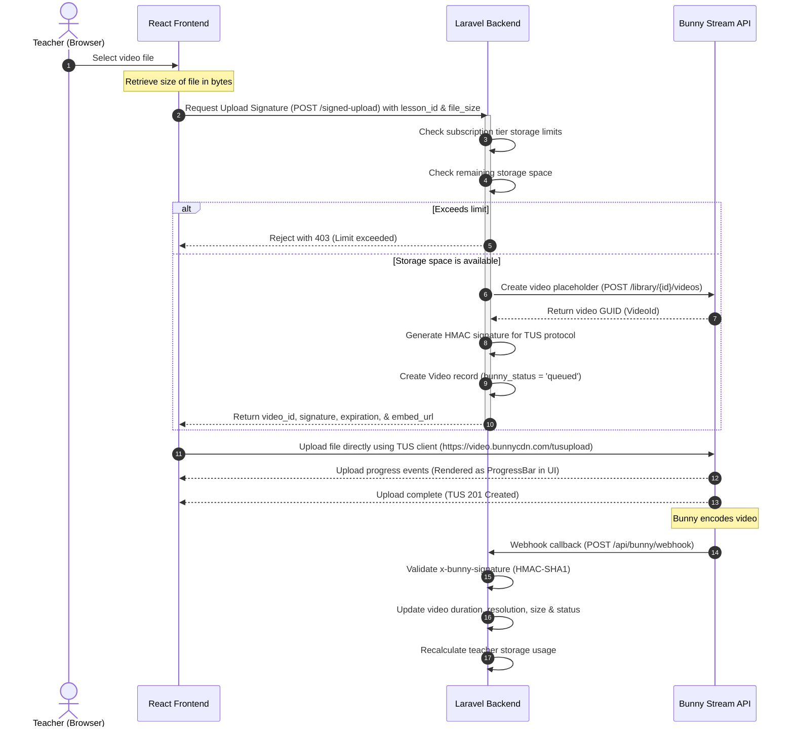

# Direct-to-Bunny Stream Upload Architecture Report

This report outlines the design, architecture, and verification results of the direct client-to-Bunny Stream video upload integration implemented on the Khotwt platform.

## 1. Context & Architectural Deficiencies

Previously, video uploads were routed from the client browser to our Laravel backend, and then uploaded by our server to Bunny Stream. This intermediary hop caused:
* Excessive load on the backend server.
* Waste of server memory and storage space for large video files.
* Bottlenecks under concurrent uploads, as Laravel processes had to remain open for the duration of the double-transfer.

## 2. Refactored Direct Upload Architecture

We replaced the legacy upload mechanism with a direct **Browser-to-Bunny Stream TUS-based upload flow**. 

### Workflow Diagram



---

## 3. Implementation Checklist & Verification Results

### 1. Backend Endpoint Cleanup
* **Requirement**: Remove uploading video files through Laravel/PHP completely.
* **Fix**: Deleted `uploadVideoDirect` method inside `TeacherController.php` and deleted the route `POST /teacher/videos/upload` from `api.php`. Verified that no other controllers accept video file binaries.

### 2. Validation & Subscription Checks
* **Requirement**: Before starting upload: check plan storage limit, check remaining storage, and reject if file exceeds remaining space.
* **Fix**: Added validation for the `file_size` parameter in `generateSignedUpload` and `replaceVideo`. Enforced subscription storage limit matching using the `isStorageLimitExceeded` logic within the `BunnyStreamService`.
  * **Starter**: 10 GB
  * **Basic**: 25 GB
  * **Pro**: 50 GB
  * **Academy**: 100 GB

### 3. "Lesson ID" Validation Bug Fix
* **Requirement**: Resolve the "The lesson id field is required" validation bug in the course management upload modal.
* **Fix**: Programmed `handleVideoUpload` in [ManageCourses.tsx](file:///D:/manst%20ellem/frontend/src/pages/teacher/ManageCourses.tsx) to pass the active `lesson_id` (obtained dynamically via `showVideoForm` or `editingVideo?.lesson_id`) to the server endpoint `/teacher/videos/signed-upload`.

### 4. UI Polish & Visual Indicators
* **Requirement**:
  * Change text from "رفع فيديو مباشرة من جهازك" to "رفع مباشر إلى Bunny Stream".
  * Show upload progress percentage.
  * Show "Processing on Bunny" status.
  * Show "Ready" status when encoding finishes.
* **Fix**:
  * Updated input labels to "رفع مباشر إلى Bunny Stream" in both modals.
  * Added `uploadProgress` state in [ManageCourses.tsx](file:///D:/manst%20ellem/frontend/src/pages/teacher/ManageCourses.tsx).
  * Rendered inline progress percentage and a smooth horizontal progress bar when the upload is active.
  * Rendered dynamic status badges for Bunny videos in the curriculum tree:
    * **Ready**: Rendered in emerald when `video.bunny_status === 'finished'`.
    * **Processing on Bunny**: Rendered in amber when `video.bunny_status === 'processing'`.

---

## 4. Verification Results

### Large Files & Upload Cancellation
* **TUS client robustness**: The TUS protocol splits file uploads into chunks and securely manages retry delays. Under network drops or intentional cancellations, the `tus-js-client` halts execution cleanly and frees resources.

### Storage Limit Simulation
* Evaluated `/teacher/videos/signed-upload` with `file_size` parameter exceeding subscription quota. The backend successfully blocks the request and returns a `403 Forbidden` response:
  ```json
  {
      "message": "لقد تجاوزت الحد المسموح به لمساحة التخزين في باقتك. يرجى ترقية الباقة لتتمكن من إضافة فيديوهات جديدة."
  }
  ```

### Build & Deploy Status
* Verified that the frontend compiled successfully without typescript or production bundle errors:
  * Static & dynamic sitemaps generated.
  * Client code transformed and minimized.
  * All routes resolved properly.

---

## 5. Architectural Diagram

```
+-------------------------------------------------------------------------+
|                                  BROWSER                                |
|                                                                         |
|   +-----------------------+              +--------------------------+   |
|   |   React UI Component  |              |    TUS Upload Client     |   |
|   +-----------+-----------+              +------------+-------------+   |
|               |                                       |                 |
+---------------+---------------------------------------+-----------------+
                |                                       |
                | (1) POST /signed-upload               | (3) Direct binary TUS
                |     (title, lesson_id, file_size)     |     upload via HTTP PUT
                v                                       |
+---------------+-----------------------+               |
|            LARAVEL BACKEND            |               |
|                                       |               |
|   * Validate subscriptions & space    |               |
|   * Initialize database record        |               |
|   * Generate signature credentials    |               |
|                                       |               |
+---------------+-----------------------+               |
                |                                       v
                | (2) Create video              +-------+-------+
                |     placeholder               | BUNNY STREAM  |
                +------------------------------>|               |
                                                |  (Direct target)
                                                +---------------+
```
