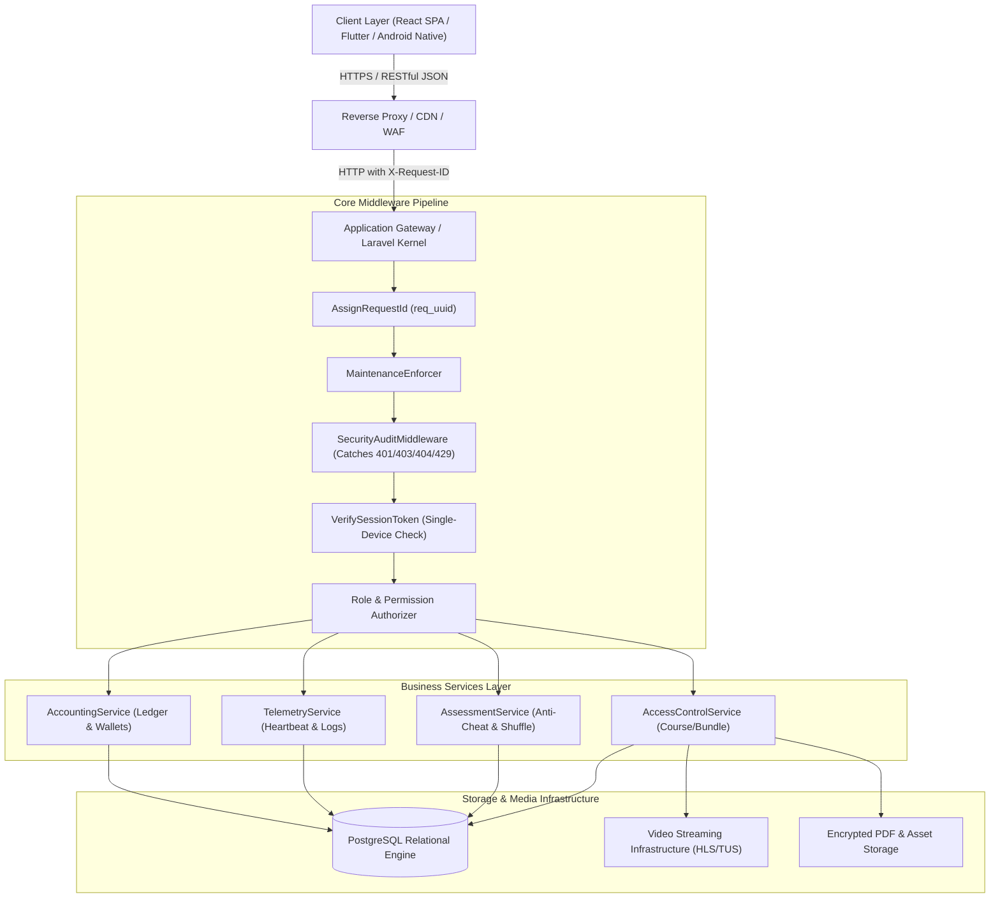
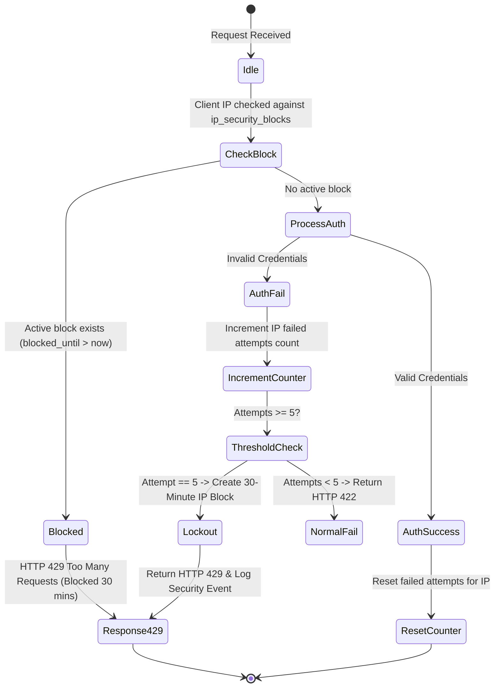
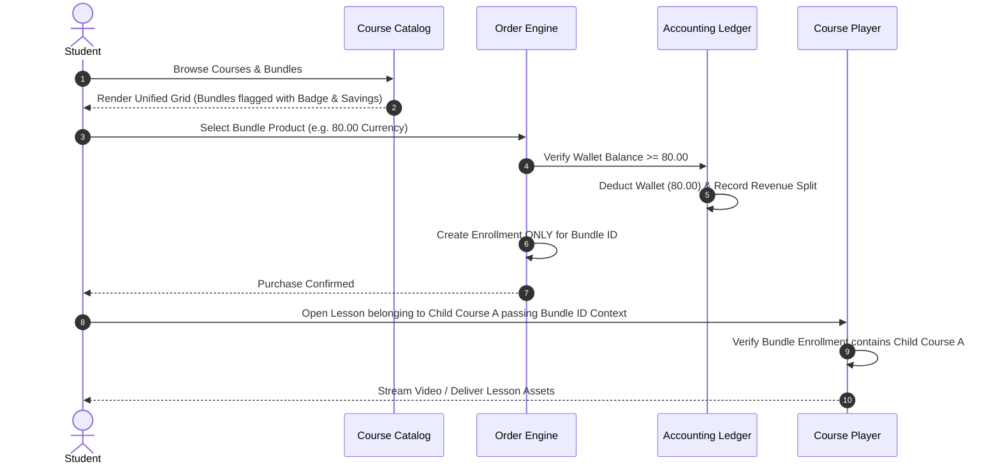
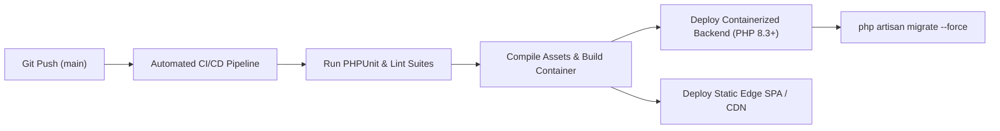

# EduTech Enterprise Blueprint — Universal Educational Platform Specification
**Document Type**: Universal Product & Engineering Architecture Specification  
**Scope**: Reusable Master Template for Enterprise Learning Management Systems (LMS) & Educational Platforms  
**Target Applications**: Multi-Teacher SaaS, Single-Educator Academies, Educational Centers & Tutoring Franchises, K-12 Virtual Schools, Corporate & Medical Training Platforms  
**Design System Relationship**: 100% Decoupled (Visual Theme / UI Styling can be redesigned independently via UI/UX design tools such as UI UX Pro Max)  
**Core Architecture Pattern**: Server-First (Laravel REST API + Decoupled SPA/Mobile Client + PostgreSQL Relational Engine + Cloud Streaming CDN)  
**Version**: `2.0.0-Enterprise-Template`  

---

## فهرس المحتويات (Table of Contents)
1. [Architectural Philosophy & Decoupling Strategy](#1-architectural-philosophy--decoupling-strategy)
2. [Platform Classification & Configuration Matrix](#2-platform-classification--configuration-matrix)
3. [Section A: Platform Core Architecture](#section-a-platform-core-architecture)
4. [Section B: Core Non-Negotiable Business Rules](#section-b-core-non-negotiable-business-rules)
5. [Section C: Relational Data Model & Schema Blueprint](#section-c-relational-data-model--schema-blueprint)
6. [Section D: Universal API Contracts & Endpoint Registry](#section-d-universal-api-contracts--endpoint-registry)
7. [Section E: Defensive Security, Rate Limiting & Brute-Force Protection](#section-e-defensive-security-rate-limiting--brute-force-protection)
8. [Section F: Subsystem Workflows (Student, Educator, Administrator)](#section-f-subsystem-workflows-student-educator-administrator)
9. [Section G: Assessment, Proctoring & Anti-Cheat Engine](#section-g-assessment-proctoring--anti-cheat-engine)
10. [Section H: Student Activity Monitoring, Presence & Heartbeat Telemetry](#section-h-student-activity-monitoring-presence--heartbeat-telemetry)
11. [Section I: Financial Ledger, Double-Entry Accounting & Wallets](#section-i-financial-ledger-double-entry-accounting--wallets)
12. [Section J: Educator SaaS, Subscriptions & Resource Management](#section-j-educator-saas-subscriptions--resource-management)
13. [Section K: Modular Dynamic Taxonomy System](#section-k-modular-dynamic-taxonomy-system)
14. [Section L: Decoupled UI/UX Layer & Design System Adapter](#section-l-decoupled-uiux-layer--design-system-adapter)
15. [Section M: Mobile & Android APK Architecture Specification](#section-m-mobile--android-apk-architecture-specification)
16. [Section N: Testing & Quality Assurance Protocols](#section-n-testing--quality-assurance-protocols)
17. [Section O: Infrastructure, Deployment & Multi-Cloud Pipeline](#section-o-infrastructure-deployment--multi-cloud-pipeline)
18. [Section P: "DO NOT BREAK THIS" Universal Engineering Guardrails](#section-p-do-not-break-this-universal-engineering-guardrails)
19. [Section Q: AI Agent Implementation Protocol](#section-q-ai-agent-implementation-protocol)

---

## 1. ARCHITECTURAL PHILOSOPHY & DECOUPLING STRATEGY

### 1.1 The Decoupled Engineering Principle
This blueprint explicitly separates **WHAT the platform does** (Core Product Logic, Access Security, Relational Schema, Financial Ledgers, Anti-Cheat, and Telemetry) from **HOW it visually looks** (Brand Colors, Typography, Component Shapes, Hero Layouts, and Marketing Aesthetics).

```
┌─────────────────────────────────────────────────────────────────────────┐
│                       DECOUPLED DESIGN SYSTEM                           │
│  (Tailwind / Shadcn / UI UX Pro Max / Theme Tokens / Native Mobile UI)   │
└────────────────────────────────────┬────────────────────────────────────┘
                                     │ Pure RESTful JSON / Bearer Tokens
┌────────────────────────────────────▼────────────────────────────────────┐
│                    PROVEN PLATFORM CORE ENGINE                          │
│                                                                         │
│  ┌───────────────────────┐ ┌───────────────────────┐ ┌────────────────┐ │
│  │ Product Access Scope  │ │ Anti-Cheat Proctoring │ │ Activity Heart │ │
│  │ (Independent Bundles) │ │ (Shuffle / Fullscreen)│ │ (90s FailSafe) │ │
│  └───────────────────────┘ └───────────────────────┘ └────────────────┘ │
│  ┌───────────────────────┐ ┌───────────────────────┐ ┌────────────────┐ │
│  │  Double-Entry Ledger  │ │ Single-Device Session │ │ 30-Min Lockout │ │
│  │  (Teacher/Platform)   │ │  (Session Token UUID) │ │ (Brute Force)  │ │
│  └───────────────────────┘ └───────────────────────┘ └────────────────┘ │
│                                                                         │
│                      PostgreSQL Relational Engine                       │
└─────────────────────────────────────────────────────────────────────────┘
```

### 1.2 Multi-Theme Portability
A new platform derived from this blueprint can adopt any visual identity without altering a single database migration, API route, or access policy:
- **Style A (Modern Dark SaaS)**: Neon accents, high-contrast borders, dark gray backgrounds.
- **Style B (Academic / Institutional)**: Light mode, serif/sans pairing, navy/emerald color palettes.
- **Style C (Youth / K-12 Playful)**: Vibrant colors, rounded pill buttons, playful iconography.
- **Style D (Corporate / Enterprise LMS)**: Neutral slate, minimalist data tables, dense layouts.

---

## 2. PLATFORM CLASSIFICATION & CONFIGURATION MATRIX

Every deployment parameterizes the platform using this matrix:

| Component / Subsystem | Classification | Description & Parameterization |
| :--- | :--- | :--- |
| **Server-First Authority** | `[CORE]` | DB is single source of truth. No client-side offline storage for financial or progress data. |
| **Authentication & Single-Device Token** | `[CORE]` | Sanctum Bearer token + unique `session_token` UUID invalidating prior logins. |
| **Brute-Force Defense (30-Min IP Block)** | `[CORE]` | 5 failed attempts $\rightarrow$ attempt 6 blocks IP for 30 minutes with HTTP 429. |
| **Curriculum Hierarchy (Course $\rightarrow$ Unit $\rightarrow$ Lesson)** | `[CORE]` | Standard multi-tiered educational content container. |
| **Independent Product Bundle Engine** | `[CORE]` | Bundle Purchase $\neq$ Child Course Purchase. Scoped access via `context_bundle_id`. |
| **Anti-Cheat & Shuffle Proctoring** | `[CORE]` | Fullscreen, blur tracking, random question/option permutation, locked correct answers. |
| **Double-Entry Financial Ledger** | `[CORE]` | Audit trails for all wallet transactions, platform cuts, educator earnings, and refunds. |
| **Activity & Presence Telemetry** | `[CORE]` | 90-second non-blocking heartbeats, throttled video milestones, 5-minute online threshold. |
| **Phone Number / Identity Validation** | `[CLIENT CONFIG]` | Parameterized regex (e.g. Egypt `^01[0125]`, Saudi `^05[0-9]`, E.164 International). |
| **Platform Currency** | `[CLIENT CONFIG]` | Configurable currency code & symbol (`EGP`, `SAR`, `AED`, `USD`, `EUR`). |
| **Platform Business Model** | `[CLIENT CONFIG]` | Choose: `MULTI_TEACHER_SAAS`, `SINGLE_EDUCATOR`, `ACADEMY_CENTER`, or `HYBRID`. |
| **Student Type Categorization** | `[OPTIONAL]` | Segment students into cohorts (e.g., `online` vs `in_person_center`). Can be toggled off. |
| **Educator SaaS Subscriptions** | `[OPTIONAL]` | Monthly/Quarterly/Annual platform fees and storage quotas for teachers. Omitted in single-teacher mode. |
| **Prepaid Scratch Codes** | `[OPTIONAL]` | Physical/digital redemption codes. Can be replaced or supplemented with online payment gateways. |
| **Streaming Video Provider** | `[INTEGRATION]` | Default: Bunny.net Stream (TUS upload). Alternates: Cloudflare Stream, Vimeo, AWS S3/CloudFront. |
| **Payment Gateway Provider** | `[INTEGRATION]` | Adapters for Stripe, Paymob, Fawry, Moyasar, PayPal, or Manual Bank Verification. |
| **Visual Styling & Branding** | `[UI ONLY]` | Colors, typography, spacing, logos, hero illustrations, dark/light theme tokens. |

---

## SECTION A: PLATFORM CORE ARCHITECTURE

### A.1 High-Level Architecture Topology


### A.2 Technical Specifications
- **Backend API**: PHP 8.3+ / Laravel 11+ RESTful JSON architecture.
- **Client Application**: Decoupled Single-Page Application (React / Vue) or Native Mobile App (Kotlin / Swift / Flutter).
- **Database Engine**: PostgreSQL 15+ utilizing explicit foreign key constraints, composite performance indexes, and JSONB columns for flexible configurations.
- **State Handling**: Token-based stateless authentication (`Bearer <SanctumToken>`) augmented with a server-side active session token.

---

## SECTION B: CORE NON-NEGOTIABLE BUSINESS RULES

### B.1 Product Ownership & Bundle Decoupling
1. **The Independence Axiom**:
   $$\text{Product}_{\text{Bundle}} \neq \sum \text{Product}_{\text{Standalone}}$$
   Purchasing a Course Bundle purchases **only** the Bundle. It does **not** create purchase records, enrollments, or ownership flags for the child courses individually.
2. **Scoped Content Consumption**:
   When consuming a lesson belonging to Course $A$ through Bundle $C$, the client passes `context_bundle_id = C`. The access service verifies that the user owns an active enrollment in Bundle $C$, and that Course $A$ is a valid member of Bundle $C$.
3. **Curriculum Immutability**:
   Bundles never duplicate units, lessons, or videos in the database. They serve as polymorphic references to original standalone assets.

### B.2 Single-Device Session Security
1. A user account may have only **one** active device session at any given millisecond.
2. Every successful login generates a new `current_session_token` (UUID v4) and invalidates all prior tokens:
   ```php
   $user->tokens()->delete();
   $user->update(['current_session_token' => (string) Str::uuid()]);
   ```
3. If an account is opened on a second device, requests from the first device receive HTTP 401 with a payload indicating session usurpation (`SESSION_INVALIDATED`).

### B.3 Anti-Cheat & Examination Integrity
1. **Server-Side Answer Protection**: Correct answers for questions must **never** appear in the API payload delivered to the client during an exam attempt.
2. **Random Shuffle Mapping**: Question sequences and answer option order are randomly permuted upon exam initialization per student and frozen in the database:
   ```json
   {
     "question_order": [14, 2, 8, 19, 5],
     "options_order": { "14": [3, 1, 4, 2], "2": [2, 4, 1, 3] }
   }
   ```
3. **Locked Results**: Upon submission, scores are computed server-side. Answer keys remain locked until explicitly released by the instructor or platform administrator.

### B.4 Fail-Safe Telemetry Logging
Telemetry (activity logs, heartbeats, video milestones) must **never** block, fail, or roll back a primary educational or financial transaction. All telemetry service calls must be safely encapsulated:
```php
try {
    $this->telemetry->recordEvent(...);
} catch (\Throwable $e) {
    Log::warning("Telemetry recording suppressed: " . $e->getMessage());
}
```

---

## SECTION C: RELATIONAL DATA MODEL & SCHEMA BLUEPRINT

### C.1 Core Entity-Relationship Topology
```
┌─────────────────┐       ┌─────────────────┐       ┌─────────────────┐
│      users      │───┬──<│     courses     │───┬──<│      units      │
│ (all personas)  │   │   │  (all products) │   │   └────────┬────────┘
└────────┬────────┘   │   └────────┬────────┘   │            │
         │            │            │            │   ┌────────▼────────┐
         │            │            │            └──<│     lessons     │
         │            │            │                └────────┬────────┘
         │            │            │                         │
         │            │   ┌────────▼────────┐       ┌────────▼────────┐
         │            └──<│   enrollments   │       │ videos & pdfs   │
         │                │ (scoped access) │       └─────────────────┘
         │                └─────────────────┘
         │
         ├───────────────<┌─────────────────┐
         │                │student_sessions │  (Indexed Presence State)
         │                └─────────────────┘
         │
         ├───────────────<┌─────────────────┐
         │                │  activity_logs  │  (Chronological Audit Feed)
         │                └─────────────────┘
         │
         └───────────────<┌─────────────────┐
                          │  wallet_ledger  │  (Financial Source of Truth)
                          └─────────────────┘
```

### C.2 Universal Data Dictionaries

#### 1. Table: `users`
| Column | Type | Nullable | Description & Constraints |
| :--- | :--- | :--- | :--- |
| `id` | BigIncrements | No | Primary Key |
| `name` | String(255) | No | Full display name |
| `email` | String(255) | No | Unique index, normalized lowercase |
| `phone` | String(50) | Yes | Parameterized format |
| `secondary_phone` | String(50) | Yes | Optional guardian/emergency contact |
| `password` | String(255) | No | Bcrypt hashed |
| `role` | Enum | No | `student`, `teacher`, `admin`, `super_admin` |
| `status` | Enum | No | `active`, `pending`, `rejected`, `disabled` |
| `current_session_token` | UUID | Yes | Active session validator |
| `metadata` | JSONB | Yes | Client-specific profile fields |
| `timestamps` | Timestamps | No | `created_at`, `updated_at` |

#### 2. Table: `courses`
| Column | Type | Nullable | Description & Constraints |
| :--- | :--- | :--- | :--- |
| `id` | BigIncrements | No | Primary Key |
| `educator_id` | UnsignedBigInt | No | FK $\rightarrow$ `users.id` |
| `title` | String(255) | No | Course display title |
| `slug` | String(255) | No | Unique URL-friendly slug |
| `price` | Decimal(10,2) | No | Base product price |
| `discount_price` | Decimal(10,2) | Yes | Computed or fixed promotional price |
| `is_published` | Boolean | No | Default `false` |
| `is_bundle` | Boolean | No | Discriminator: `true` indicates Course Bundle |
| `view_limit` | Integer | Yes | Max video playback views permitted |
| `metadata` | JSONB | Yes | Taxonomy IDs, categories, tags |

#### 3. Table: `course_bundle_items`
| Column | Type | Nullable | Description & Constraints |
| :--- | :--- | :--- | :--- |
| `parent_course_id` | UnsignedBigInt | No | FK $\rightarrow$ `courses.id` (where `is_bundle = true`) |
| `child_course_id` | UnsignedBigInt | No | FK $\rightarrow$ `courses.id` (where `is_bundle = false`) |
| `order` | Integer | No | Display sorting order |
| *Composite Key* | Composite | No | `PRIMARY KEY (parent_course_id, child_course_id)` |

#### 4. Table: `enrollments`
| Column | Type | Nullable | Description & Constraints |
| :--- | :--- | :--- | :--- |
| `id` | BigIncrements | No | Primary Key |
| `user_id` | UnsignedBigInt | No | FK $\rightarrow$ `users.id` |
| `course_id` | UnsignedBigInt | No | FK $\rightarrow$ `courses.id` (Enrolled product) |
| `payment_id` | UnsignedBigInt | Yes | FK $\rightarrow$ financial transaction record |
| `granted_by` | UnsignedBigInt | Yes | FK $\rightarrow$ `users.id` (Admin/system grant) |
| `expires_at` | Timestamp | Yes | Access expiration boundary |
| *Composite Index* | Index | No | `(user_id, course_id, expires_at)` |

#### 5. Table: `student_sessions`
| Column | Type | Nullable | Description & Constraints |
| :--- | :--- | :--- | :--- |
| `id` | BigIncrements | No | Primary Key |
| `user_id` | UnsignedBigInt | No | FK $\rightarrow$ `users.id` |
| `session_token` | String(64) | No | Unique session hash |
| `ip_address` | String(45) | No | IPv4/IPv6 client address |
| `user_agent` | String(500) | Yes | Browser / Device identifier |
| `is_active` | Boolean | No | Online state flag |
| `last_activity_at` | Timestamp | No | Updated every 90 seconds |
| *Composite Index* | Index | No | `(user_id, is_active, last_activity_at)` |

#### 6. Table: `security_events`
| Column | Type | Nullable | Description & Constraints |
| :--- | :--- | :--- | :--- |
| `id` | BigIncrements | No | Primary Key |
| `event_type` | String(100) | No | `login_failed`, `brute_force_blocked`, `unknown_route`, etc. |
| `ip_address` | String(45) | No | Originating IP address |
| `request_id` | String(64) | No | `req_<uuid>` correlation identifier |
| `http_method` | String(10) | No | GET, POST, PUT, DELETE |
| `requested_path` | String(500) | No | URL path requested |
| `user_id` | UnsignedBigInt | Yes | FK $\rightarrow$ `users.id` (if authenticated) |
| `severity` | Enum | No | `low`, `medium`, `high`, `critical` |
| `metadata` | JSONB | Yes | Sanitized contextual payload |

---

## SECTION D: UNIVERSAL API CONTRACTS & REGISTRY

Every endpoint follows strict RESTful patterns, returns uniform JSON envelopes, and expects `Accept: application/json`.

### D.1 Standard Response Envelope
```json
{
  "success": true,
  "status": 200,
  "data": {},
  "message": "Operation completed successfully.",
  "request_id": "req_8f1b2c4e-5a6d-7e8f-9a0b-1c2d3e4f5a6b"
}
```

### D.2 Core Endpoint Registry

| Method | Endpoint Path | Auth Scope | Responsibility |
| :--- | :--- | :--- | :--- |
| `POST` | `/api/v1/auth/login` | Public | Authenticates credentials, checks IP blocks, returns Bearer token. |
| `POST` | `/api/v1/auth/register` | Public | Registers a new student account, allocates empty wallet. |
| `POST` | `/api/v1/auth/logout` | Authenticated | Revokes Sanctum token, marks session inactive. |
| `GET` | `/api/v1/catalog/courses` | Public | Returns courses & bundles in a unified catalog query. |
| `GET` | `/api/v1/catalog/courses/{id}` | Public | Detailed course/bundle view including syllabus and savings. |
| `POST` | `/api/v1/student/presence/heartbeat` | `role:student` | Background 90s heartbeat pulse updating session timestamp. |
| `POST` | `/api/v1/student/products/{id}/purchase` | `role:student` | Deducts wallet balance, creates enrollment, records double-entry cut. |
| `GET` | `/api/v1/student/courses/{cId}/lessons/{lId}` | `role:student` | Fetches lesson content with scoped authorization (standalone or bundle). |
| `POST` | `/api/v1/student/lessons/{lId}/video-progress`| `role:student` | Updates watched milestones (25%, 50%, 75%, 100%). |
| `POST` | `/api/v1/student/assessments/{id}/start` | `role:student` | Generates randomized shuffle map and initiates proctoring timer. |
| `POST` | `/api/v1/student/assessments/{id}/violation` | `role:student` | Logs fullscreen escape or tab switch to proctoring log. |
| `POST` | `/api/v1/student/assessments/{id}/submit` | `role:student` | Scores answers server-side and locks result review. |
| `GET` | `/api/v1/admin/security/threats` | `role:admin` | Live security feed, event analytics, and blocked IPs. |
| `POST` | `/api/v1/admin/security/unblock-ip` | `role:admin` | Manually clears an active 30-minute IP lockout. |
| `POST` | `/api/v1/admin/maintenance/toggle` | `role:admin` | Activates global maintenance mode with Super Admin bypass. |
| `POST` | `/api/v1/admin/academic-cycle/reset` | Super Admin | Executes destructive year reset requiring confirmation phrase. |

---

## SECTION E: DEFENSIVE SECURITY & THREAT MITIGATION

### E.1 Brute-Force Rate Limiting Engine


### E.2 Sensitive Metadata Sanitizer
Before writing any request payload or exception to `security_events` or system logs, sensitive fields are filtered through an automated scrubbing mask:
```php
class DataSanitizer {
    private const REDACTED_KEYS = [
        'password', 'password_confirmation', 'token', 'access_token',
        'auth_token', 'credit_card', 'card_number', 'cvv', 'secret', 'api_key'
    ];

    public static function scrub(array $data): array {
        foreach ($data as $key => $val) {
            if (Str::contains(strtolower($key), self::REDACTED_KEYS)) {
                $data[$key] = '[REDACTED]';
            } elseif (is_array($val)) {
                $data[$key] = self::scrub($val);
            }
        }
        return $data;
    }
}
```

---

## SECTION F: SUBSYSTEM WORKFLOWS

### F.1 Student Learning & Purchase Workflow


### F.2 Educator Content Authoring Workflow
1. **Course Container**: Educator initializes course metadata, price, and visibility.
2. **Curriculum Hierarchy**: Units $\rightarrow$ Lessons $\rightarrow$ Content Elements (Bunny/Cloudflare Video, PDF documents, Quizzes).
3. **Packaging / Bundling**: Educator combines multiple courses into a separate Bundle product with a dedicated price point.
4. **Subscription Quota Check**: If Educator SaaS is enabled, the platform verifies storage limits before issuing signed TUS direct upload URLs.

---

## SECTION G: ASSESSMENT, PROCTORING & ANTI-CHEAT ENGINE

### G.1 Anti-Cheat Architecture Matrix

| Attack Vector | Countermeasure Mechanism | Enforcement Point |
| :--- | :--- | :--- |
| **Tab Switching / Multitasking** | Window `blur` & `visibilitychange` listeners dispatch violation alerts to backend. | Client Monitor + Server Log |
| **Window Resizing / Inspection** | Strict HTML5 Fullscreen enforcement. Exiting fullscreen logs a violation. | Client Event Listener |
| **Peer Answer Sharing** | Per-student Question & Option order randomization via `shuffle_mapping`. | Server Permutation Engine |
| **Network Payload Sniffing** | Correct answer keys are completely stripped from start-exam API response. | API Serializer Pipeline |
| **Persistent Repeat Cheating** | Violation counter threshold (default: 3). Exceeding limit forces auto-submission. | Server Enforcement Hook |
| **Post-Exam Answer Leakage** | Exam results show student score only. Answer review requires educator unlock. | Results Policy Guard |

---

## SECTION H: TELEMETRY & PRESENCE TELEMETRY

### H.1 Lightweight Presence Polling Protocol
To avoid server strain at scale, the presence heartbeat operates under mathematical bounds:
- **Baseline Interval**: Exactly one pulse every **90 seconds** while the page is active.
- **Client Window Focus Throttling**: If a student flips between application tabs, focus events are throttled with a minimum cooldown of **45 seconds**.
- **Execution Cost**: Runs as a single indexed query:
  ```sql
  UPDATE student_sessions SET last_activity_at = NOW() WHERE session_token = ?;
  ```
  Execution duration is bounded to $< 1\text{ ms}$.

### H.2 Video Milestone Telemetry
Video tracking avoids continuous per-second database writes:
1. `video_started`: Recorded once upon initial playback.
2. `video_milestone_25`, `video_milestone_50`, `video_milestone_75`: Debounced and throttled to fire at most once per 2 hours per lesson to accommodate repeated scrubbing.
3. `video_completed`: Permanently logged once 90%+ duration threshold is reached.

---

## SECTION I: FINANCIAL LEDGER & MONETIZATION ENGINE

### I.1 Double-Entry Bookkeeping Flow
Every monetary transaction executes as a balanced relational ledger entry:

```
[Student Wallet / Cash Inflow] 
      │
      ├──> [Platform Earning Ledger] (e.g. 20% Platform Fee)
      │
      └──> [Educator Earning Ledger] (e.g. 80% Net Educator Share)
```

### I.2 Financial Transaction Types
- `credit_code_redeem`: Student wallet balance credited via voucher/scratch card.
- `debit_product_purchase`: Funds transferred for course, bundle, or standalone exam.
- `credit_educator_share`: Net proceeds added to educator payable balance.
- `credit_platform_share`: Platform operational fee booked.
- `debit_educator_payout`: Educator balance settled via bank/cash disbursement.
- `refund_reversal`: Reverses original entry; refunds student, docks educator.

---

## SECTION J: EDUCATOR SaaS & RESOURCE MANAGEMENT

> *Note: This module is categorized as `[OPTIONAL]`. It is activated for multi-educator marketplaces and deactivated for single-instructor platforms.*

### J.1 Subscription Lifecycle & Resource Tiers
- **Billing Durations**: Monthly, Quarterly, Semi-Annual, Annual.
- **Resource Quotas**:
  - `max_storage_gb`: Video CDN storage limit (supports decimal precision, e.g. 5.5 GB).
  - `max_courses`: Active published course allowance.
  - `max_students`: Distinct student enrollment capacity.
- **Subscription Middleware**:
  ```php
  Route::middleware(['auth:sanctum', 'subscription.active'])->group(function () {
      Route::post('/teacher/courses', ...);
      Route::post('/teacher/videos/signed-upload', ...);
  });
  ```
  If subscription expires, existing content remains viewable to enrolled students, but creation of new courses or video uploads is blocked.

---

## SECTION K: MODULAR DYNAMIC TAXONOMY SYSTEM

The educational hierarchy is represented as a self-referencing or normalized 3-layer dynamic taxonomy:

$$\text{Department / Faculty} \longrightarrow \text{Academic Stage / Level} \longrightarrow \text{Grade / Semester / Cohort}$$

- **Department** (e.g., General Studies, Engineering, Preparatory, Medicine).
- **Stage** (e.g., Undergraduate, High School, Foundation Year).
- **Grade / Level** (e.g., Year 1, Semester 2, Grade 12).
- **Universal Linking**: Courses, students, and educators can bind to one or more taxonomy nodes, powering automated catalog filtering and tailored recommendations.

---

## SECTION L: DECOUPLED UI/UX LAYER & DESIGN SYSTEM ADAPTER

### L.1 Separation of Concerns
The frontend consuming this API must treat UI styling as a swappable presentation adapter.

```
┌─────────────────────────────────────────────────────────────┐
│                    API Contract Model                       │
│  { title, price, discount_price, is_bundle, bundle_savings }│
└──────────────────────────────┬──────────────────────────────┘
                               │ Adapter Layer
┌──────────────────────────────▼──────────────────────────────┐
│                    Custom UI/UX Theme                       │
│                                                             │
│   Theme A (SaaS Dark)    Theme B (Minimal White)   Theme C  │
│   [Rounded-2xl / Neon]   [Sharp / High Typography] [Native] │
└─────────────────────────────────────────────────────────────┘
```

### L.2 CourseCard Presentation Requirements
Any custom design system implementing the course card must fulfill these functional data contracts:
1. Must display `title`, `educator_name`, `price`.
2. If `is_bundle == true`:
   - Must render a visually prominent **Bundle Identifier** (e.g., Badge: "Course Bundle" / "كورس مجمع").
   - Must display count and titles of included courses.
   - Must display original combined price with strikethrough styling.
   - Must calculate and display **Savings Metric**: $\text{Savings} = \text{Original Price} - \text{Bundle Price}$.
3. Must preserve independent product purchase state: if bundle is purchased, card shows "Enrolled / Start Learning", but standalone child course cards continue showing their individual purchase buttons.

---

## SECTION M: MOBILE & ANDROID APK ARCHITECTURE SPECIFICATION

The platform architecture is **native mobile ready** without backend modifications:

### M.1 Architectural Readiness Assessment
- **API Transport**: Pure JSON RESTful endpoints compatible with Retrofit (Android), Ktor (Kotlin Multiplatform), or Alamofire (iOS).
- **Authentication**: Stateless Bearer tokens stored in Android `EncryptedSharedPreferences` / Android Keystore.
- **Active Heartbeat**: Executed via Android Jetpack `WorkManager` or foreground playback services.
- **Exam Anti-Cheat**: Android WindowManager flag `FLAG_SECURE` prevents screenshots and screen recording; `Activity.onUserLeaveHint()` captures home button minimization.

### M.2 Video Streaming on Mobile
- HLS playlists (`.m3u8`) streamed directly to Google **Media3 / ExoPlayer**.
- Domain-restricted streaming signed via short-lived CDN authentication tokens.

---

## SECTION N: TESTING & QUALITY ASSURANCE PROTOCOLS

Any implementation of this blueprint must validate against the following mandatory test suites:

1. **Bundle Independence Suite**:
   - Asserts purchasing a bundle grants access to child lessons.
   - Asserts purchasing a bundle **does not** create standalone enrollments in child courses.
   - Asserts deleting or unpublishing a child course does not corrupt parent bundle integrity.
2. **Anti-Cheat Verification Suite**:
   - Asserts correct answers are absent from start-exam API.
   - Asserts shuffle order is unique per student and immutable during exam attempt.
   - Asserts 4th logged violation triggers automated submission.
3. **Brute-Force & Security Suite**:
   - Asserts 5 consecutive failed logins return HTTP 422.
   - Asserts 6th attempt returns HTTP 429 with 30-minute lockout timestamp.
   - Asserts valid credentials during lockout are rejected with HTTP 429.
   - Asserts non-existent API routes return safe JSON 404 with correlation ID.
4. **Concurrency Benchmark Suite**:
   - Asserts 50 concurrent heartbeat pulses resolve with zero lock contention in $< 100\text{ ms}$.

---

## SECTION O: INFRASTRUCTURE & DEPLOYMENT PIPELINE



### O.1 Deployment Topology
- **Web App / Frontend**: Static hosting at the Edge (Vercel, Cloudflare Pages, AWS S3+CloudFront).
- **Backend API**: Containerized stateless PHP-FPM / Nginx application (Railway, AWS ECS, Google Cloud Run, or VPS Docker-Compose).
- **Database**: Managed PostgreSQL instance with automated daily point-in-time recovery (PITR).
- **Media Transcoding**: Cloud streaming partner with automatic HLS multi-bitrate encoding (Bunny.net Stream, Cloudflare Stream).

---

## SECTION P: "DO NOT BREAK THIS" UNIVERSAL ENGINEERING GUARDRAILS

- [ ] **NEVER introduce client-side offline storage for financial balances or course ownership**. PostgreSQL is the single source of truth.
- [ ] **NEVER create child enrollments upon bundle purchase**. Bundles remain self-contained products.
- [ ] **NEVER expose question answer keys in active examination API payloads**.
- [ ] **NEVER allow telemetry or heartbeat failures to interrupt core educational playback or purchasing**.
- [ ] **NEVER store or log raw passwords, access tokens, or payment card details in logs or security tables**.
- [ ] **NEVER execute academic year resets without atomic locking, confirmation verification, and pre-generated financial archives**.

---

## SECTION Q: AI AGENT IMPLEMENTATION PROTOCOL

When an AI coding assistant is tasked with building a new platform using this blueprint:

1. **Step 1: Configuration Ingestion**:
   Read client parameters:
   - `{{PLATFORM_NAME}}`
   - `{{CURRENCY_CODE}}` (e.g. `USD`, `SAR`, `EGP`)
   - `{{PHONE_VALIDATION_REGEX}}`
   - `{{BUSINESS_MODEL}}` (`MULTI_TEACHER_SAAS` vs `SINGLE_EDUCATOR`)
2. **Step 2: Database Migration Assembly**:
   Run database migrations strictly in entity order: Users $\rightarrow$ Taxonomy $\rightarrow$ Courses $\rightarrow$ Bundles $\rightarrow$ Units $\rightarrow$ Lessons $\rightarrow$ Exams $\rightarrow$ Enrollments $\rightarrow$ Wallets $\rightarrow$ Telemetry $\rightarrow$ Security.
3. **Step 3: Core Service Implementation**:
   Implement services before controllers: `AccessControlService`, `AssessmentService`, `TelemetryService`, `AccountingService`, `SecurityService`.
4. **Step 4: Design System Attachment**:
   Attach the visual styling library (Tailwind, Shadcn, UI UX Pro Max) to the client components while adhering strictly to Section L data contracts.
5. **Step 5: Automated Verification**:
   Execute the Section N test suite. A build is declared successful **only** when all feature tests pass with 100% assertions.
