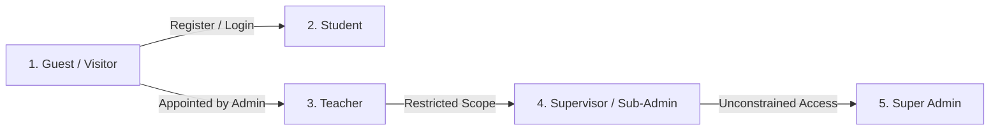
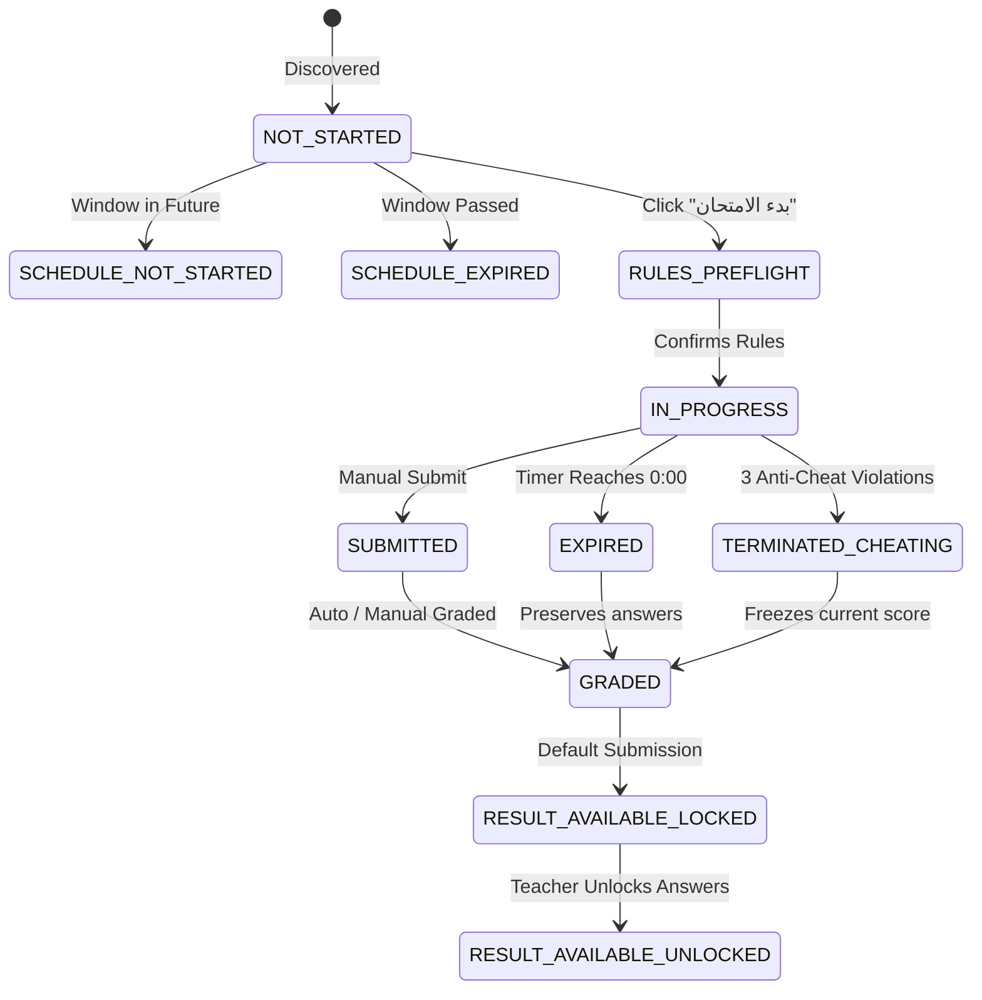

# Khotwt Platform — Master UX/UI Specification & Behavioral Architecture
**المرجع الشامل والنهائي لتجربة وواجهة المستخدم وقواعد العمل السلوكية**
**Platform Name**: منصة خطوتك التعليمية (Khotwt Educational Platform)  
**Codebase Identifier**: `bebo2646/khotwt-platform`  
**Interface Philosophy**: RTL-First (Arabic Primary), Server-Authoritative, Zero Silent Mutations  
**Theme Engine**: Adaptive Dual-Theme (Default: Dark Mode `#030712` / Alternate: Light Mode `#F8FAFC`)  
**Primary Brand Accent**: `#6D5DFC` (Electric Indigo / Violet)  
**Current Production Build**: `v2.4.0-production`  
**Document Classification**: Platform Master UX Reference & Single Source of Truth (SSOT)

---

## فهرس المحتويات (Comprehensive Table of Contents)

1. [UX Overview & Strategic Vision](#1-ux-overview--strategic-vision)
2. [Users & Roles Architecture (RBAC & UX Personas)](#2-users--roles-architecture)
3. [Information Architecture (IA) & Conceptual Maps](#3-information-architecture-ia)
4. [Sitemap & Master Route Registry](#4-sitemap--master-route-registry)
5. [Authentication & Security Experience UX](#5-authentication--security-experience-ux)
6. [Public & Guest Experience UX](#6-public--guest-experience-ux)
7. [Student Experience UX](#7-student-experience-ux)
8. [Teacher Experience UX](#8-teacher-experience-ux)
9. [Admin & Supervisor Experience UX](#9-admin--supervisor-experience-ux)
10. [Responsive Navigation & Dynamic Overflow UX](#10-responsive-navigation--dynamic-overflow-ux)
11. [Unified Teacher Discovery System UX](#11-unified-teacher-discovery-system-ux)
12. [Course Experience UX](#12-course-experience-ux)
13. [Bundle Experience UX (Independent Product Model)](#13-bundle-experience-ux-independent-product-model)
14. [Course Assessments UX (Quizzes & Homeworks)](#14-course-assessments-ux-quizzes--homeworks)
15. [Monthly Exams UX (Standalone High-Stakes Assessments)](#15-monthly-exams-ux-standalone-high-stakes-assessments)
16. [Exam Timing & Clock Synchronization UX](#16-exam-timing--clock-synchronization-ux)
17. [Anti-Cheat Proctoring Engine UX](#17-anti-cheat-proctoring-engine-ux)
18. [Answer Protection & Explicit Unlock UX](#18-answer-protection--explicit-unlock-ux)
19. [Financial & Wallet Experience UX](#19-financial--wallet-experience-ux)
20. [Activity Monitoring & Platform Presence UX](#20-activity-monitoring--platform-presence-ux)
21. [Maintenance Mode UX](#21-maintenance-mode-ux)
22. [Academic Year Reset UX (Destructive Administrative Procedure)](#22-academic-year-reset-ux)
23. [Responsive Screen Engine & Breakpoint Geometry UX](#23-responsive-screen-engine--breakpoint-geometry-ux)
24. [Light & Dark Theme Engine UX](#24-light--dark-theme-engine-ux)
25. [Forms & Input Systems UX](#25-forms--input-systems-ux)
26. [Teacher Edit Form UX Specification](#26-teacher-edit-form-ux-specification)
27. [Modals, Overlays & Drawers UX](#27-modals-overlays--drawers-ux)
28. [Standard State System UX (Loading, Empty, Error, Success)](#28-standard-state-system-ux)
29. [Notification Engine UX](#29-notification-engine-ux)
30. [Accessibility & Touch Target Standards UX](#30-accessibility--touch-target-standards-ux)
31. [Language, Typography & RTL UX](#31-language-typography--rtl-ux)
32. [Error Handling & Crash Prevention UX (ErrorBoundary)](#32-error-handling--crash-prevention-ux)
33. [Security & Permissions Matrix (RBAC)](#33-security--permissions-matrix-rbac)
34. [Reusable Component Inventory](#34-reusable-component-inventory)
35. [Screen-by-Screen Master Inventory](#35-screen-by-screen-master-inventory)
36. [Complete User Journey Map](#36-complete-user-journey-map)
37. [Platform UX Consistency Rules](#37-platform-ux-consistency-rules)
38. [Established UX Decision Log](#38-established-ux-decision-log)
39. [Known UX Edge Cases & Needs Decision](#39-known-ux-edge-cases--needs-decision)
40. [Implementation vs. Documentation Reconciliation](#40-implementation-vs-documentation-reconciliation)
41. [Final UX Verification Checklist](#41-final-ux-verification-checklist)

---

## 1. UX Overview & Strategic Vision

### 1.1 Purpose of this Document
This document is the **complete, canonical UX/UI master specification** for the Khotwt platform. It specifies what every user sees, what every user can do, how screens behave across all states, how transitions occur, and how backend business rules govern visual experiences.

It is tailored specifically for:
- **UI/UX Designers**: To understand component hierarchies, spacing scales, micro-interactions, responsive behavior, and theme contrast.
- **Frontend Developers**: To know which states must be rendered, which events must be fired, and what guards prevent UI regressions.
- **Backend Developers**: To understand how API error codes, timestamps, and validation envelopes dictate frontend UX reactions.
- **QA Engineers**: To test against concrete behavioral contracts rather than subjective assumptions.
- **AI Coding Agents**: To preserve established UX patterns and never silently invent undocumented behaviors.

### 1.2 Core UX Philosophy & Principles
1. **RTL-Native First (العربية لغة أصيلة)**: Layouts, interactions, icons, animations, and typography hierarchies respect Right-to-Left conventions natively.
2. **Cognitive Clarity for High-Stress Learning (الوضوح الأكاديمي)**: Exams, lecture videos, and deadlines induce anxiety. The UI avoids sudden layout shifts (CLS), visual ambiguity, or unexpected session terminations.
3. **Server-Authoritative Honesty (الشفافية الزمنية والمادية)**: Timers compute skew against server clocks; statistics reflect live database counts; pricing snapshots are immutably preserved.
4. **Single-Device Focus & Zero Piracy Friction**: DRM protection, single-session tokens, and moving watermarks protect intellectual property without punishing legitimate students.
5. **Universal Fluidity (مرونة القياسات)**: Every component adapts dynamically across 10 defined viewport breakpoints (from 390px mobile screens to 1920px 4K monitors).
6. **Graceful Degradation (لا شاشات بيضاء)**: No failure or unexpected condition ever terminates in a raw crash or blank screen.

---

## 2. Users & Roles Architecture

The platform supports 5 distinct user personas:



### 2.1 Personas & Permissions Summary

| Role | Primary Objectives | Main Navigation | Key Restrictions |
| :--- | :--- | :--- | :--- |
| **Guest / Visitor** | Discover teachers, browse courses, view Monthly Exam schedule, evaluate platform, create account. | Public Navbar (`الرئيسية`, `الأقسام`, `الكورسات`, `المعلمون`, `الامتحانات`, `تسجيل دخول`, `حساب جديد`). | Cannot access lesson players, PDFs, exams, student dashboard, wallet, or management tools. |
| **Student** | Access enrolled courses, watch video lectures with dynamic DRM watermarks, solve quizzes, take high-stakes Monthly Exams, recharge wallet with 12-char codes, review grades. | Student Navbar (`الرئيسية`, `كورساتي`, `الامتحانات`, `المحفظة`, `الأقسام`), profile dropdown with wallet pill, notification bell. | Cannot edit courses, access teacher tools, view model answers before authorized unlock, or login on multiple devices simultaneously. |
| **Teacher** | Author and publish courses, upload videos to Bunny.net Stream, create quizzes/homeworks/bubble sheets, author Monthly Exams, review student attempts, unlock answers, inspect earnings. | Teacher Navbar (`الرئيسية`, `كورساتي`, `الكورسات المجمعة`, `الامتحانات الشهرية`, `الطلاب`, `تقرير الأرباح`, `إدارة الفيديوهات`, `اشتراكي`, `تغيير المرور`). | Cannot access global admin settings, view other teachers' students/earnings, modify taxonomy, or initiate year resets. |
| **Supervisor / Sub-Admin** | Perform delegated operational tasks governed by assigned RBAC permissions (e.g., student support, course approval, code generation). | Admin Collapsible Sidebar with group navigation filtered strictly by assigned permissions. | Cannot perform actions outside assigned permission keys; cannot manage other admins or execute academic year reset without explicit permissions. |
| **Super Admin** | Complete, unconstrained platform oversight: financial ledgers, security lockouts, teacher approvals, maintenance mode, Bunny storage, academic year reset. | Complete Admin Portal Sidebar with all management modules, security monitors, and system settings. | None. Unconstrained bypass capabilities across maintenance mode and all features. |

---

## 3. Information Architecture (IA)

```
KHOTWT PLATFORM
│
├── PUBLIC SCOPE (Unauthenticated / Discovery)
│   ├── Home (Hero, Real Stats, Taxonomy, Featured Courses, Teachers Carousel, FAQ, Footer)
│   ├── Teachers Directory (Catalog, Filters by Grade/Subject/Mode, Infinite Carousel)
│   ├── Teacher Public Profile (Header, Bio, Mode, Published Courses, Enrolled Count)
│   ├── Courses Directory (Catalog, Stage/Grade/Subject Filters, Search, Discount Badges)
│   ├── Course Detail (Syllabus, Units, Lessons Preview, Video Durations, Purchase Trigger)
│   ├── Departments Directory (Academic & Vocational Tracks)
│   ├── Department Detail (Track Specific Courses & Teachers)
│   ├── Monthly Exams Catalog (Exams Schedule, Grade Badges, Price/Free Badges, Attempt Status)
│   └── System Pages (Login, Register, Pending Approval, Rejected Account, Maintenance, 404, 500)
│
├── STUDENT SCOPE (Authenticated Learning Hub)
│   ├── Dashboard (Progress Overview, Enrolled Quick-Resume, History, Teachers Carousel)
│   ├── Enrolled Courses (Active vs Completed Tabs, Direct Resume Links)
│   ├── Lesson Viewer (Bunny Stream Video, Anti-Piracy Watermark, Views Counter, PDFs, Quizzes)
│   ├── PDF Viewer (Protected Reader, Zoom, Page Nav, Download Blocker)
│   ├── Exam Player (Preflight Rules Screen, Fullscreen Mode, Anti-Cheat Listeners, Auto-Submit)
│   ├── Exam Results (Score Card, Question Breakdown, Teacher Feedback)
│   ├── Monthly Exam Player (Locked Proctoring Screen, Countdown Bar, Bubble Sheet / MCQ)
│   ├── Monthly Exam Results (Score Gauge, Cheat Violation Banner, Unlocked Answers Review)
│   ├── Wallet (Balance Hero Card, 12-Char Code Redemption, Transaction Ledger)
│   └── Profile Dashboard (Personal Info, Parent Contact, Academic Grade, Password Change)
│
├── TEACHER SCOPE (LMS & SaaS Operations)
│   ├── Dashboard (Metric Cards, Revenue Summary, Storage Bar, Quick Course Actions)
│   ├── Manage Courses (Course Table, Unit Builder, Lesson Items, Publishing Toggle)
│   ├── Manage Bundles (Bundle Card Listing, Multi-Course Package Builder, Discount Pricing)
│   ├── Exams Manager (Course Quizzes and Homeworks Table)
│   ├── Exam Builder (Course Quiz vs Homework vs Standalone Monthly Exam Engine)
│   ├── Monthly Exams Hub (Management Table, Active Status, Attempts Modal, Grading Hub)
│   ├── Attempt Review (Cheat Timeline, Questions Inspection, Answer Unlock Action)
│   ├── Students Roster (Enrolled Students List, Progress Metrics, Contact Details)
│   ├── Video Library (Bunny Stream Direct Uploader, Video Transcoding Status, Usage Tracking)
│   ├── Revenue Report (Earnings Ledger, Monthly Aggregates, Commission Breakdown)
│   └── Subscription & Plans (Current Plan Quota, Storage Consumption, Code Pool, Upgrade)
│
└── ADMIN SCOPE (Governance, Security & Finance)
    ├── Dashboard (Platform Key Metrics, Revenue Cards, System Health, Live Activity)
    ├── Teachers Management (Teachers Table, Add/Edit Teacher Modal, Status, Password Reset)
    ├── Teacher Subscriptions (Assign Plan, Adjust Storage/Codes Quota, Expiration)
    ├── Students Management (Students Roster, Search by Phone/Email, Disable/Enable)
    ├── Pending Registrations (Review Queue, Approve/Reject with Reason)
    ├── Student Activity Monitoring (Live Heartbeat Table, Active Lessons, Device OS)
    ├── Teacher Activity Monitoring (Course Edits, Exam Creations, Upload Audits)
    ├── Security Monitoring (Brute-Force Lockouts, IP Bans, Suspicious Activity)
    ├── Course Catalog Management (Platform-wide Course Visibility, Force Publish/Archive)
    ├── Monthly Exams Management (Exams List, Attempts Inspector, Cross-Teacher Review)
    ├── Recharge Codes (Generate 12-char Codes, Batch Export, Status Tracking)
    ├── Financial Analytics (Gross Volume, Platform Commissions, Teacher Net Payouts)
    ├── Reports & Exports (Ledger Breakdown, Excel Exports)
    ├── Payouts Management (Teacher Settlement History, Mark as Paid)
    ├── Bunny.net Dashboard (Storage Zone Breakdown, Bandwidth Metrics, Video IDs)
    ├── Taxonomy Management (Dynamic Stages, Grades, and Department Track Editor)
    ├── Admin Management (Sub-Admin User Roles, Permissions Assignment)
    └── Platform Settings (Enterprise Settings, Maintenance Toggle, Academic Year Reset)
```

---

## 4. Sitemap & Master Route Registry

Audited directly from [`frontend/src/App.tsx`](file:///D:/manst%20ellem/frontend/src/App.tsx):

| Route Path | Component | Scope / Guard | UX Purpose |
| :--- | :--- | :--- | :--- |
| `/` | `Home` | Public (Layout) | Master landing page with stats, courses, teachers carousel, and CTA |
| `/maintenance` | `Maintenance` | Public Standalone | Platform lockdown screen with live refresh and ETA |
| `/login` | `Login` | Public (Layout) | Dual identifier authentication (Email / Egyptian Mobile) |
| `/register` | `Register` | Public (Layout) | Student registration with stage/grade auto-sync & phone validation |
| `/pending-approval` | `PendingApproval` | Public Standalone | Notice for students awaiting administrative manual verification |
| `/rejected-account` | `RejectedAccount` | Public Standalone | Rejection reason screen with automatic database cleanup trigger |
| `/courses` | `Courses` | Public (Layout) | Course catalog with multi-facet filters and search |
| `/course/:id` | `CourseDetail` | Public (Layout) | Detailed curriculum preview, teacher summary, purchase trigger |
| `/courses/:id` | `CourseDetail` | Public (Layout) | Secondary alias for course detail |
| `/departments` | `Departments` | Public (Layout) | Academic & vocational track directory |
| `/departments/:slug` | `DepartmentDetail`| Public (Layout) | Department landing page with filtered courses |
| `/exams` | `MonthlyExams` | Public (Layout) | Monthly Exam discovery, pricing, and purchase entry |
| `/monthly-exams` | `MonthlyExams` | Public (Layout) | Alias for Monthly Exam discovery |
| `/teachers` | `Teachers` | Public (Layout) | Dedicated teachers directory with search & filters |
| `/teacher/:id` | `TeacherProfile` | Public (Layout) | Public teacher profile, statistics, bio, and courses |
| `/teachers/:id` | `TeacherProfile` | Public (Layout) | Secondary alias for teacher profile |
| `/stages/:gradeId` | `Courses` | Public (Layout) | Direct stage-filtered courses landing |
| `/subject/:subjectId`| `Courses` | Public (Layout) | SEO landing for subject-filtered courses |
| `/grade/:gradeId` | `Courses` | Public (Layout) | SEO landing for grade-filtered courses |
| `/chemistry` | `Courses` | Public (Layout) | Pre-filtered landing for Chemistry courses |
| `/physics` | `Courses` | Public (Layout) | Pre-filtered landing for Physics courses |
| `/arabic` | `Courses` | Public (Layout) | Pre-filtered landing for Arabic courses |
| `/grade-1-secondary` | `Courses` | Public (Layout) | Pre-filtered landing for 1st Secondary |
| `/grade-2-secondary` | `Courses` | Public (Layout) | Pre-filtered landing for 2nd Secondary |
| `/grade-3-secondary` | `Courses` | Public (Layout) | Pre-filtered landing for 3rd Secondary |
| `/change-password` | `ChangePassword` | Protected (Any Auth) | Forced or voluntary user password modification |
| `/student/dashboard` | `StudentDashboard`| Protected (`student`) | Student core hub: progress, enrolled courses, teachers carousel |
| `/student/courses` | `EnrolledCourses` | Protected (`student`) | Grid of all active and completed student enrollments |
| `/student/wallet` | `WalletPage` | Protected (`student`) | Current balance card, code redemption, transactions ledger |
| `/student/results` | `ExamResults` | Protected (`student`) | General exam history & solved evaluations list |
| `/student/exams/:id/result` | `ExamResults` | Protected (`student`) | Specific course exam result and score breakdown |
| `/monthly-exams/:id/player` | `MonthlyExamPlayer`| Protected (`student`)| Locked proctored player for standalone Monthly Exams |
| `/monthly-exams/:id/results`| `MonthlyExamResults`| Protected (`student`)| Score gauge, anti-cheat notices, unlocked answers review |
| `/student/profile` | `ProfileDashboard`| Protected (`student`) | Academic data, parent contact, personal profile editor |
| `/student/lessons/:id` | `LessonViewer` | Protected (`student`, `teacher`, `admin`) | Video lecture player, watermarking, PDFs, quizzes tab |
| `/student/pdf/:pdfId` | `PdfViewerPage` | Protected (`student`, `teacher`, `admin`) | Local PDF reader with zoom controls and copy prevention |
| `/student/exams/:id` | `ExamPlayer` | Protected (`student`) | Course exam player with rules preflight and anti-cheat |
| `/teacher` & `/teacher/dashboard` | `TeacherDashboard` | Protected (`teacher`) | Teacher KPI cards, storage progress, quick course shortcuts |
| `/teacher/courses` | `ManageCourses` | Protected (`teacher`) | Course list, status toggles, unit/lesson management links |
| `/teacher/bundles` | `ManageBundles` | Protected (`teacher`) | Package manager, bundled course selector, pricing rules |
| `/teacher/students` | `StudentsList` | Protected (`teacher`) | Enrolled students roster, progress metrics, contact links |
| `/teacher/exams` | `ExamsManager` | Protected (`teacher`) | Course quizzes and homeworks management table |
| `/teacher/exams/create`| `ExamBuilder` | Protected (`teacher`) | Assessment authoring tool (Course vs Monthly Exam) |
| `/teacher/exams/edit/:id` | `ExamBuilder` | Protected (`teacher`) | Assessment editor |
| `/teacher/revenue` | `RevenueReport` | Protected (`teacher`) | Teacher net earnings, sales count, payout status |
| `/teacher/monthly-exams` | `MonthlyExamsManagement` | Protected (`teacher`) | Teacher's Monthly Exams list & attempts inspector |
| `/teacher/monthly-exams/:examId/attempts` | `MonthlyExamsManagement` | Protected (`teacher`) | Direct deep-link to exam attempts list |
| `/teacher/videos` | `VideosManager` | Protected (`teacher`) | Bunny Stream direct video uploader & status manager |
| `/teacher/subscription`| `Subscription` | Protected (`teacher`) | Teacher subscription package details, storage & codes |
| `/teacher/plans` | `Plans` | Protected (`teacher`) | SaaS plan selection and upgrade requests |
| `/admin` & `/admin/dashboard` | `AdminDashboard` | Protected (`admin` + `dashboard.view`) | Main administrative metrics, charts, live platform state |
| `/admin/teachers` | `TeachersList` | Protected (`admin` + `teachers.manage`) | Teachers master table, edit modal, status toggle, reset password |
| `/admin/teachers/create`| `CreateTeacher` | Protected (`admin` + `teachers.manage`) | Standalone new teacher provisioning form |
| `/admin/teachers/:id/subscription` | `TeacherSubscription` | Protected (`admin` + `teacher_subscriptions.manage`) | Direct teacher quota and package editor |
| `/admin/students` | `StudentsList` | Protected (`admin` + `students.manage`) | Master students table, phone/email lookup, account lock |
| `/admin/students/pending` | `PendingStudents` | Protected (`admin` + `students.pending`) | Student registration approval/rejection queue |
| `/admin/student-activity` | `StudentActivity` | Protected (`admin` + `student_activity.view`) | Live student presence table, heartbeat tracker (90s) |
| `/admin/teacher-activity` | `TeacherActivity` | Protected (`admin` + `teacher_activity.view`) | Teacher administrative activity log |
| `/admin/courses` | `CoursesList` | Protected (`admin` + `courses.manage`) | Platform course registry, publishing override |
| `/admin/monthly-exams` | `MonthlyExamsManagement` | Protected (`admin` + `exams.manage`) | Platform-wide Monthly Exams governance and grading review |
| `/admin/monthly-exams/:examId/attempts` | `MonthlyExamsManagement` | Protected (`admin` + `exams.manage`) | Direct deep link to specific exam attempts |
| `/admin/codes` | `PurchaseCodes` | Protected (`admin` + `coupons.manage`) | Recharge codes batch generator, status filter, CSV export |
| `/admin/reports` | `ReportsPage` | Protected (`admin` + `reports.view`) | Sales ledger, revenue aggregates, Excel export |
| `/admin/financial` | `FinancialAnalytics` | Protected (`admin` + `reports.view`) | Gross sales, commissions, net balances, ledger analytics |
| `/admin/payouts` | `Payouts` | Protected (`admin` + `payouts.manage`) | Teacher payout settlement ledger, payout approvals |
| `/admin/subscriptions/requests` | `SubscriptionRequests` | Protected (`admin` + `subscription_requests.manage`) | Teacher plan upgrade request approval workflow |
| `/admin/subscription-plans` | `SubscriptionPlans` | Protected (`admin` + `subscription_plans.manage`) | SaaS plan specifications, pricing, quota config |
| `/admin/notifications` | `Notifications` | Protected (`admin` + `notifications.send`) | Broadcast push notifications dispatch console |
| `/admin/bunny` | `BunnyDashboard` | Protected (`admin` + `bunny.view`) | Bunny.net Stream CDN video storage and traffic monitor |
| `/admin/taxonomy` | `TaxonomyManagement` | Protected (`admin` + `settings.manage`) | Dynamic stages, grades, and department track editor |
| `/admin/security` | `SecurityMonitoring` | Protected (`admin` + `admins.manage`) | Brute-force IP lockout table, unblock action, 4xx/5xx logs |
| `/admin/manage` | `AdminManagement` | Protected (`admin` + `admins.manage`) | Sub-admin user roles and permissions assigner |
| `/admin/settings` | `PlatformSettings` | Protected (`admin` + `settings.manage`) | Maintenance toggle, message, ETA, academic year reset |
| `/500` | `ServerError` | Fallback | Internal server error page with retry button |
| `*` | `NotFound` | Fallback | 404 resource not found page with home navigation |

---

## 5. Authentication & Security Experience UX

### 5.1 Dual-Identifier Login Architecture
The login form (`/login`) accepts either:
1. **Registered Email Address**: Cleaned, trimmed, and evaluated case-insensitively (`LOWER(email)`).
2. **Registered Egyptian Mobile Phone**:
   - Converted from eastern arabic digits (`٠-٩`) to standard digits (`0-9`).
   - Normalized across all prefixes (`+20`, `0020`, `20`, or omitting leading zero).
   - Matched strictly against the student's registered personal phone number in the database.

### 5.2 Defensive Brute-Force Rate Limiting & Lockout Policy
Audited directly from [`SecurityMonitoringService.php`](file:///D:/manst%20ellem/backend/app/Services/SecurityMonitoringService.php):

- **Constant Limits**:
  - `MAX_FAILED_LOGIN_ATTEMPTS = 5`
  - `BLOCK_DURATION_MINUTES = 30`
- **Behavior During Attempts 1 to 5**:
  - Failed attempt increments `$block->failed_attempts`.
  - HTTP `422 Unprocessable Entity` is returned with explicit Arabic feedback:
    - If user does not exist: `"هذا الحساب غير موجود"`
    - If password is incorrect: `"كلمة المرور غير صحيحة"`
- **Behavior on Attempt 6 (Lockout Triggered)**:
  - If `$block->failed_attempts > 5`, the originating IP is immediately locked.
  - `$block->is_blocked = true`, `$block->blocked_until = now() + 30 minutes`.
  - Stored in Redis/Cache key: `"ip_security_block:{$ip}"` for 1800 seconds.
  - High severity security event logged: `repeated_auth_failure`.
  - HTTP `429 Too Many Requests` returned with payload:
    ```json
    {
      "message": "تم حظر محاولات تسجيل الدخول من هذا الجهاز لمدة 30 دقيقة بسبب تكرار البيانات غير الصحيحة.",
      "code": "IP_TEMPORARILY_BLOCKED",
      "blocked": true,
      "remaining_minutes": 30,
      "blocked_until": "ISO-TIMESTAMP"
    }
    ```
- **Behavior While Blocked**:
  - The middleware `SecurityMonitoringService::checkLoginBruteForce` executes **before** credential checking.
  - **Crucial Rule**: Even if the user enters the **100% correct credentials**, the request is immediately rejected with HTTP 429 and the block notice.
- **Expiration & Manual Unblock**:
  - The block automatically expires after 30 minutes.
  - Alternatively, a Super Admin can manually lift the block instantly from `/admin/security` by clicking `"إلغاء الحظر"`.
- **What is Intentionally NOT Shown to the User**:
  - Remaining attempts counter before ban is hidden to avoid giving attackers exact brute-force boundaries.
  - Salt, password hash details, and database queries are stripped.

### 5.3 Single-Device Concurrent Session Protection
- Every login generates a unique `session_token`.
- Every 10 minutes, the client heartbeat calls `GET /auth/check-session`.
- If a student logs in on a second device or browser:
  - The first device's `session_token` is invalidated on the server.
  - Heartbeat receives `{ valid: false }` or HTTP 401.
  - Window event `elm_session_invalid` fires.
  - User is immediately logged out with modal notice and redirected to `/login?session_invalid=true`.

### 5.4 Forced Password Change Workflow
- When an administrator creates a new teacher or resets an account password, `must_change_password` is set to `true`.
- Any authenticated API call triggers an interceptor check:
  - Dispatches `elm_must_change_password`.
  - System Alert Modal pops up:
    - Title: `"تنبيه أمني هام"`
    - Description: `"يجب تغيير كلمة المرور المؤقتة الممنوحة لك للمتابعة."`
    - Button: `"تغيير كلمة المرور الآن"` -> Routes to `/change-password`.
  - User cannot navigate away or access other dashboard pages until a new password is saved.

---

## 6. Public & Guest Experience UX

### 6.1 Public Homepage Breakdown (`/`)
The Public Homepage is divided into 9 sequential sections:

```
[ Navbar ]
├── 1. Hero Section (Brand Promise, Animated Educational Background, Dual CTA)
├── 2. Statistics Bar (Database-Driven True Counters with '+' threshold formatting)
├── 3. Academic Departments Section (Subject Category Cards with Lucide Icons)
├── 4. Featured Courses Section (Tabbed filter: All/Secondary/Prep, Course Cards)
├── 5. Teachers Section (Unified High-Contrast Teachers Carousel with Infinite Loop)
├── 6. Why Choose Khotwt? (Value Proposition Cards: Anti-Cheat, HD Streaming, Wallet)
├── 7. Platform FAQ (Accordion of high-frequency parent & student questions)
├── 8. Conversion CTA Banner (Account creation prompt with immediate registration link)
└── [ Global Footer & Floating WhatsApp Support Button ]
```

### 6.2 Homepage Statistics: Real Database Value vs. Marketing Display
Audited directly from [`frontend/src/pages/Home.tsx`](file:///D:/manst%20ellem/frontend/src/pages/Home.tsx):

- **Data Origin**: Live `GET /home-stats` query.
- **Display Formatting Rule**:
  $$\text{Display Value} = \begin{cases} \text{exact number} & \text{if } \text{count} < 10 \\ \text{"+" } + (\lfloor \text{count} / 10 \rfloor \times 10) & \text{if } \text{count} \ge 10 \end{cases}$$
- **Numerical Test Cases**:
  - `4` -> `4`
  - `9` -> `9`
  - `10` -> `+10`
  - `11` -> `+10`
  - `27` -> `+20`
  - `99` -> `+90`
  - `100` -> `+100`
  - `1,254` -> `+1,250`
- **Fallback / Loading**: 3 pulsing skeleton cards (`w-24 h-8`).

---

## 7. Student Experience UX

### 7.1 Student Dashboard (`/student/dashboard`)
1. **Welcome Header**: Student name, academic stage and grade badge, wallet balance pill.
2. **Continue Learning (استكمال المشاهدة)**:
   - Displays the last active video lecture.
   - Shows progress bar, remaining duration in natural Arabic (e.g., `متبقي 14 دقيقة`).
   - "استكمال الآن" CTA opens `LessonViewer` at the exact second last paused.
3. **Academic KPI Metrics Bar**:
   - `الكورسات المشترك بها` (Active courses).
   - `المحاضرات المكتملة` (Completed lectures).
   - `الامتحانات المحلولة` (Solved tests).
   - `متوسط الدرجات` (Average grade percentage).
4. **Upcoming Assessments (امتحانات وواجبات قادمة)**: Cards with deadline countdowns and preflight availability checks.
5. **Teachers Section**: Employs the shared `TeachersCarousel`.

### 7.2 Student Presence Heartbeat Engine
- Client sends a background POST heartbeat to `/student/activity/heartbeat` every **90 seconds**.
- Throttled to minimum 45 seconds on window focus.
- Sends current course, lesson, IP, and device user-agent to the administrative presence monitor.

---

## 8. Teacher Experience UX

### 8.1 Teacher Dashboard (`/teacher/dashboard`)
- KPI Cards: Enrolled Students Count, Total Published Courses, Net Available Earnings (ج.م), Active Monthly Exams.
- SaaS Quota Bar: Video storage consumed vs allocated quota (GB), Student activation codes pool balance. Turns amber at 80%, rose at 95%.
- Quick Action Shortcuts: Create Course, Add Bundle, Create Exam, Upload Video.

### 8.2 Curriculum Management (`/teacher/courses`)
- Master courses table with status badges (`منشور`, `مسودة`, `سنتر فقط`).
- Unit & Lesson Builder:
  - Add Unit (Order, Title).
  - Add Lesson (Title, Description).
  - Add Content: Video (Bunny Stream ID, View limits), PDF Resource (File upload, page preview), Quiz/Homework.

---

## 9. Admin & Supervisor Experience UX

### 9.1 Admin Layout Navigation (`AdminLayout.tsx`)
- High-contrast, persistent sidebar with grouped modules:
  - **الرئيسية**: لوحة التحكم العامة (`/admin/dashboard`).
  - **المستخدمين والمحتوى**: المعلمون (`/admin/teachers`), نشاط المعلمين (`/admin/teacher-activity`), الطلاب (`/admin/students`), نشاط الطلاب (`/admin/student-activity`), مراجعة التسجيلات (`/admin/students/pending`), الكورسات (`/admin/courses`), الأقسام والمراحل (`/admin/taxonomy`), الامتحانات الشهرية (`/admin/monthly-exams`).
  - **العمليات المالية**: طلبات الاشتراكات (`/admin/subscriptions/requests`), أكواد الشحن (`/admin/codes`), التحليلات المالية (`/admin/financial`), التقارير المالية (`/admin/reports`), مستحقات المعلمين (`/admin/payouts`).
  - **التواصل والربط**: الإشعارات الجماعية (`/admin/notifications`).
  - **الإعدادات والأمان**: إدارة الباقات (`/admin/subscription-plans`), إحصائيات Bunny (`/admin/bunny`), صلاحيات المشرفين (`/admin/manage`), الأمان ومكافحة التهديدات (`/admin/security`), إعدادات المنصة (`/admin/settings`).

### 9.2 Enterprise Platform Settings (`/admin/settings`)
Governs enterprise features:
- `require_student_approval`: Requires manual admin approval for student registration.
- `auto_delete_rejected_accounts`: Automatically wipes rejected account records to release email/phone.
- `view_limit_enabled`: Platform-wide default view limit enforcement.
- `default_max_views`: Default allowed views per video (default: 10).
- `video_threshold_seconds`: Minimum seconds required to count a view (default: 300s = 5 mins).
- `grace_period_days`: Days allowed for expired teacher subscriptions before lockdown (default: 7 days).

---

## 10. Responsive Navigation & Dynamic Overflow UX

### 10.1 The Dynamic Navigation Engine
Audited from [`useResponsiveNav.ts`](file:///D:/manst%20ellem/frontend/src/hooks/useResponsiveNav.ts):
- Off-screen hidden container measures exact pixel widths of all nav items synchronously using `ResizeObserver` and font readiness checks.
- When container width shrinks:
  - Items exceeding available width are automatically detached from the horizontal bar.
  - Detached items are moved into the user profile dropdown under `"روابط إضافية"`.
  - A pulsing brand-primary dot appears on the profile button if the user is currently on an overflowed page.

### 10.2 Navigation Priority Order (Higher Priority Stays Visible First)
- **Teacher Priorities**:
  1. `الرئيسية` (Priority 1 — Never hides)
  2. `كورساتي` (Priority 2)
  3. `الامتحانات الشهرية` (Priority 3)
  4. `الطلاب` (Priority 4)
  5. `الكورسات المجمعة` (Priority 5)
  6. `تقرير الأرباح` (Priority 6)
  7. `إدارة الفيديوهات` (Priority 7)
  8. `اشتراكي` (Priority 8)
  9. `تغيير المرور` (Priority 9 — First to move to dropdown)
- **Student Priorities**:
  1. `الرئيسية` (Priority 1 — Never hides)
  2. `كورساتي` (Priority 2)
  3. `الامتحانات` (Priority 3)
  4. `المحفظة` (Priority 4)
  5. `الأقسام` (Priority 5 — First to move to dropdown)

---

## 11. Unified Teacher Discovery System UX

### 11.1 Shared Experience Rule
Public discovery (`/`, `/teachers`) and authenticated Student Dashboard (`/student/dashboard`) share the **exact same** [`TeachersCarousel.tsx`](file:///D:/manst%20ellem/frontend/src/components/ui/TeachersCarousel.tsx) and [`TeacherCard.tsx`](file:///D:/manst%20ellem/frontend/src/components/ui/TeacherCard.tsx).

### 11.2 Teacher Card Geometry & Fallback Spec
- Height: `475px` (mobile) / `505px` (desktop).
- Background: Dynamic CSS token `--teacher-card-bg` (`#142240` Dark, `#FFFFFF` Light).
- Portrait Image: `265px - 290px` height with `object-[center_20%]`.
- Image Error / Fallback: Displays gradient background with teacher initials extracted via `getTeacherInitials(name)` at `text-4xl`/`text-5xl` font-black.
- Mode Badges:
  - `online`: Emerald pill with pulsing animated dot.
  - `center`: Amber pill with school icon.
  - `both`: Purple pill with violet dot.

### 11.3 Infinite Virtual Carousel Physics
- Safe clone buffer: Generates minimum 7 cloned sets.
- Silent normalization: Seamlessly resets virtual index to center set on transition end with transitions temporarily disabled.
- Breakpoints:
  - Desktop (`>= 1280px`): `4.25` visible cards (4 full + partial peek of 5th).
  - Tablet (`1024px - 1279px`): `3` cards.
  - Tablet (`768px - 1023px`): `2` cards.
  - Mobile (`< 768px`): `1` card with `15%` peek of neighboring cards.

---

## 12. Course UX

### 12.1 Video Player DRM & Watermark
Within `LessonViewer`:
- **Bunny Stream Integration**: Responsive iframe with adaptive HLS video streaming.
- **Dynamic Floating Watermark**:
  - Semi-transparent pill containing student name, registered phone number, and IP address.
  - Repositions smoothly to random coordinates on screen every 10–15 seconds.
  - Prevents screen recording and illegal lecture redistribution.
- **View Limit Counter**:
  - Shows allowed vs consumed views (e.g., `مشاهدتان متبقيتان من أصل 3`).
  - Upon reaching view quota: Video locks with modal prompt to enter an unlock code.

---

## 13. Bundle UX (Independent Product Model)

> [!IMPORTANT]
> **COURSE ≠ BUNDLE**
> Purchasing a Course Bundle **does not** create separate child-course enrollments. The student purchases and accesses the Bundle as an **independent, unified product**.

- Bundle Card: Stacked layers icon, multi-course count badge (e.g., `باقة تشمل 3 كورسات`).
- Pricing: Displays original cumulative price struck-through + bundle price + savings pill (`وفرت 150 ج.م`).
- Curriculum: Groups units under child course titles inside the bundle context.

---

## 14. Course Assessments UX (Quizzes & Homeworks)

### 14.1 Bubble Sheet Input UX
For homeworks configured with `homework_type === 'bubble_sheet'`:
- Displays a high-density, rapid-input answer sheet.
- Keyboard shortcuts:
  - Keys `1`, `A`, `أ` -> Option 1.
  - Keys `2`, `B`, `ب` -> Option 2.
  - Keys `3`, `C`, `ج` -> Option 3.
  - Keys `4`, `D`, `د` -> Option 4.
  - Arrow keys navigate questions without mouse clicks.

---

## 15. Monthly Exams UX (Standalone High-Stakes Assessments)

### 15.1 The 11 Visible Exam States



| State Name | What User Sees | Primary Button Label | Available Actions | Forbidden Actions | Next Possible State |
| :--- | :--- | :--- | :--- | :--- | :--- |
| `NOT_STARTED` | Exam card with specs (duration, questions, max score). | `بدء الامتحان الآن` | Read specs, click to enter preflight rules. | Cannot solve questions; attempt is not created. | `RULES_PREFLIGHT` |
| `SCHEDULE_NOT_STARTED` | Amber card with calendar icon & formatted opening date. | `الامتحان غير متاح بعد ⏱️` | Click opens modal with countdown timer. | Cannot enter rules or start attempt. | `NOT_STARTED` |
| `SCHEDULE_EXPIRED` | Rose card with warning icon & closing timestamp. | `انتهت فترة إتاحة الامتحان ⏱️` | View expiration notice. | Cannot purchase, start, or take exam. | None (Archived) |
| `RULES_PREFLIGHT` | Instruction screen with anti-cheat warnings and terms. | `أوافق على الشروط وأبدأ الامتحان` | Read rules, agree, or click "العودة للخلف". | Questions and answers are NOT rendered. | `IN_PROGRESS` |
| `IN_PROGRESS` | Locked proctored player, timer bar, question navigator. | `تسليم الامتحان النهائي` | Answer questions, navigate, auto-save drafts. | Cannot exit fullscreen, switch tabs, or copy. | `SUBMITTED`, `EXPIRED`, `TERMINATED_CHEATING` |
| `SUBMITTED` | Loading confirmation overlay with celebration icon. | `عرض النتيجة والتقرير` | Click to view score report. | Answers cannot be modified or re-submitted. | `GRADED` |
| `GRADED` | Score metrics card with percentage and passing badge. | `عرض النتيجة والتقرير` | Inspect score, view violation log. | Cannot re-attempt if single attempt exam. | `RESULT_AVAILABLE_LOCKED` |
| `EXPIRED` | Auto-submit notice ("انتهى الوقت المحدد"). | `الذهاب لصفحة النتائج` | Direct route to results. | Cannot answer remaining questions. | `GRADED` |
| `TERMINATED_CHEATING`| Rose warning banner: "تم إنهاء الامتحان لمخالفة القواعد". | `عرض التقرير والمخالفات` | View violation timeline and frozen score. | Attempt permanently locked. | `GRADED` |
| `RESULT_AVAILABLE_LOCKED`| Score gauge visible; model answers hidden with locked pill. | `العودة لقائمة الامتحانات` | View own score, passing status, violations. | Cannot view correct answers or explanations. | `RESULT_AVAILABLE_UNLOCKED` |
| `RESULT_AVAILABLE_UNLOCKED`| Full review mode: green/red highlights and explanations. | `العودة لقائمة الامتحانات` | Inspect model answers, read explanations. | Answers cannot be re-locked. | None (Completed) |

---

## 16. Exam Timing & Clock Synchronization UX

### 16.1 The Effective Duration Formula
Client clocks cannot be trusted. The platform strictly enforces **server-authoritative time**:

$$\text{Effective Student Duration} = \min(\text{Configured Duration}, \text{Availability Window Deadline} - \text{Server Time Now})$$

#### Concrete Scenarios:
- **Scenario A (Full Duration)**:
  - Configured Duration: `60 minutes`.
  - Deadline: `05:00 PM`.
  - Student Starts At: `03:30 PM`.
  - Remaining Window: `90 minutes`.
  - **Visible Timer**: Starts at **`60:00`**.
- **Scenario B (Truncated by Deadline)**:
  - Configured Duration: `60 minutes`.
  - Deadline: `12:00 PM`.
  - Student Starts At: `11:35 AM`.
  - Remaining Window: `25 minutes`.
  - **Visible Timer**: Starts at **`25:00`** (NOT `60:00`).

### 16.2 Client Clock Skew & Refresh Protection
- Client calculates `clockSkewMs = new Date(server_now).getTime() - Date.now()`.
- On page refresh: Timer does NOT reset. It recalculates remaining seconds authoritatively from stored `expires_at`.
- If client manually adjusts browser clock: Countdown continues calculating against `currentServerTimeMs = Date.now() + clockSkewMs`. Timer tampering is impossible.
- When `remaining <= 0`: Automatic submission triggers with reason `'time_expired'`.

---

## 17. Anti-Cheat Proctoring Engine UX

### 17.1 Monitored Events
1. `fullscreen_exit`: Fullscreen mode closed.
2. `tab_switch`: Document visibility changes (`document.hidden === true`).
3. `window_blur`: Focus leaves browser window.
4. `copy_attempt` / `paste_attempt`: Clipboard manipulation blocked via `preventDefault()`.
5. `right_click_attempt`: Context menu blocked.

### 17.2 Violation Warning Progression (Default 3 Allowed)
- **Violations 1 & 2**: Toast notification: `"تم اكتشاف مغادرة شاشة الامتحان. متبقي 2 محاولة فقط."` Counter increments in header badge.
- **Violation Before Final (1 attempt remaining)**: High-priority Alert Modal:
  - Title: `"تحذير أخير ⚠️"`
  - Description: `"أي محاولة أخرى لمغادرة شاشة الامتحان ستؤدي إلى إنهاء الاختبار فوراً وتثبيت درجاتك الحالية!"`
- **Final Violation (Quota Exceeded)**:
  - Attempt terminated immediately on server (`is_terminated_for_cheating = true`).
  - Score frozen based on questions answered up to that second.
  - Alert modal: `"تم إنهاء الامتحان تلقائياً لتجاوز الحد الأقصى للمخالفات المسموح بها."`
  - Routes to results page.

---

## 18. Answer Protection & Explicit Unlock UX

### 18.1 Protection Policy
Model answers and explanations remain **hidden by default** to preserve exam integrity across student groups.

### 18.2 Locked vs. Unlocked Visual States
- **Locked State**:
  - Score, percentage, passing badge, and violation count are visible.
  - Rose alert box: `"تم حجب عرض الإجابات النموذجية الصحيحة لهذا الامتحان تلقائياً لحماية نزاهة التقييم. يمكن للمعلم فتح الإجابات لاحقاً."`
  - Questions and correct answers are completely hidden.
- **Teacher Unlock Action**:
  - In `/teacher/monthly-exams` or `/admin/monthly-exams`, reviewer opens attempt review modal.
  - Box displays: `حالة عرض الإجابات النموذجية: محجوبة عن الطالب 🔒`.
  - Button: `"إظهار الإجابات الصحيحة للطالب"` (Emerald button with unlock icon).
  - Click executes `POST .../unlock-answers`.
  - UI updates immediately to `مفتوحة ومتاحة للطالب 🔓` with timestamp and auditor name.
- **Unlocked Student State**:
  - Full question-by-question review expands.
  - Correct options outlined in green with `"الإجابة الصحيحة النموذجية"` badge.
  - Student's incorrect choices outlined in red with strike-through styling.
  - Model explanation text displayed.
  - **No Re-Lock Rule**: Re-locking is unsupported in current implementation.

---

## 19. Financial & Wallet Experience UX

### 19.1 Financial Business Rules & Revenue Split
Audited directly from [`RevenueSharingService.php`](file:///D:/manst%20ellem/backend/app/Services/RevenueSharingService.php):

1. **Standard Revenue Share (النسبة القياسية الافتراضية)**:
   - **Teacher Share**: `80%` of paid amount.
   - **Platform Share**: `20%` of paid amount.
2. **SaaS Subscription Exception (استثناء باقات الاشتراك المباشرة)**:
   - When a teacher subscribes to a flat SaaS plan (`billing_type !== 'revenue_sharing'`), the platform takes **0% commission** on course sales.
   - **Teacher Share**: `100%`.
3. **Discounted Purchases**:
   - Commissions are calculated against the **actual paid amount** after discount, not original price.
   - Database stores `original_price`, `discount_amount`, and `amount` (final paid).

### 19.2 Student Electronic Wallet (`/student/wallet`)
- **Balance Card**: Electric indigo card displaying `XXX.XX ج.م`.
- **12-Char Code Redemption**:
  - Input field with instant validation via `POST /wallet/redeem`.
  - Success: Balance increments, celebration toast appears, transaction logged.
  - Error: Specific Arabic message (e.g., `"كود الشحن المدخل غير صالح أو انتهت صلاحيته"`).
- **Transaction History**: Ledger showing type, amount, date, and rolling balance after transaction.

---

## 20. Activity Monitoring & Platform Presence UX

### 20.1 Student Activity (`/admin/student-activity`)
- Governed by permissions: `student_activity.view`, `student_activity.view_financial`, `student_activity.view_security`, `student_activity.view_sessions`.
- Real-time table fed by 90-second student heartbeats:
  - Student Name & Phone.
  - Current Academic Status (Active / Away / Offline).
  - Currently Active Lesson & Course.
  - Device OS & Browser.
  - IP Address and Session duration.

### 20.2 Platform Presence (`platform_presence.view`)
- Live counter and roster: `"الموجودون الآن على المنصة"`.
- Real-time online student & teacher counts.

---

## 21. Maintenance Mode UX

### 21.1 Public & Student Experience (`/maintenance`)
- Active students and guests navigating any route are redirected to `/maintenance`.
- Displays animated progress bar, Khotwt emblem, title: `"🚧 جاري تحديث المنصة"`.
- Displays administrative update message and ETA if set.
- Background polling checks system status every **20 seconds**. If maintenance is deactivated, user is auto-redirected to `/`.

### 21.2 Admin Bypass Banner
- Super Admins bypass maintenance mode.
- Top warning banner displays across all admin pages:
  - Text: `"وضع الصيانة مفعل حالياً. المنصة محجوبة عن الطلاب والمعلمين."`
  - Action button: `"إلغاء تفعيل وضع الصيانة"` -> Instantly disables maintenance mode platform-wide.

---

## 22. Academic Year Reset UX

Audited from [`AcademicYearResetService.php`](file:///D:/manst%20ellem/backend/app/Services/AcademicYearResetService.php) & [`AdminDashboard.tsx`](file:///D:/manst%20ellem/frontend/src/pages/admin/Dashboard.tsx):

> [!CAUTION]
> **DESTRUCTIVE ADMINISTRATIVE PROCEDURE**
> This procedure permanently wipes all student accounts, wallets, enrollments, and attempts.

### 22.1 Two-Step Confirmation Workflow
1. **Mandatory Backup Gate (`isBackupDownloaded`)**:
   - The confirmation input is completely hidden until the admin clicks `"تنزيل نسخة احتياطية كاملة لقاعدة البيانات"`.
   - Backup downloads complete database snapshot.
2. **Strict Confirmation Input**:
   - Admin must type the exact confirmation string: `"RESET NEW ACADEMIC YEAR"`.
3. **Execution Lock & Archiving**:
   - Distributed atomic cache lock (`academic_year_reset_lock`, TTL: 120s) prevents double-clicks.
   - Generates complete financial archive file before deletion.
4. **Scope of Action**:
   - **Deleted**: All student users, wallets, enrollments, attempts, answers, violations.
   - **Preserved**: All teachers, sub-admins, courses, units, lessons, videos, PDFs, and exam questions.

---

## 23. Responsive Screen Engine & Breakpoint Geometry UX

The platform layout adapts across 10 critical screen widths:

| Viewport Width | Device Category | Navbar Behavior | Teachers Carousel | Tables & Grids |
| :--- | :--- | :--- | :--- | :--- |
| **1920px** | Ultra-wide Desktop | All links visible, max-w-1600px | 4.25 cards visible | 4-column course grids |
| **1600px** | Standard Desktop | All links visible | 4.25 cards visible | 4-column course grids |
| **1440px** | Compact Desktop | useResponsiveNav begins overflow check | 4.25 cards visible | 3-column course grids |
| **1280px** | Small Desktop | Lowest priority nav item moves to dropdown | 4.25 cards visible | 3-column course grids |
| **1100px** | Large Tablet Landscape| 2-3 nav items move to profile menu | 3 cards visible | 2-column course grids |
| **1024px** | Tablet Landscape | Admin sidebar converts to drawer mode | 3 cards visible | 2-column course grids |
| **900px** | Mid Tablet | Profile menu holds multiple items | 2 cards visible | Form grids collapse to 1-col |
| **768px** | Tablet Portrait | Desktop links hide; Mobile hamburger appears | 2 cards visible | Tables convert to stacked cards |
| **430px** | Large Smartphone | Full mobile drawer; All links accessible | 1 card with 15% side peek | Single-column cards |
| **390px** | Standard Smartphone | Full mobile drawer; Compact logo emblem | 1 card with side peek | Fixed-bottom modal buttons |

---

## 24. Light & Dark Theme Engine UX

- Dark Theme default: `#030712`.
- Light Theme: `#F8FAFC` (WCAG AA compliant contrast $\ge 4.5:1$).
- Toggle button: Sun icon in Dark mode / Moon icon in Light mode.
- Root class toggle: `document.documentElement.classList.toggle('light-theme')`.
- Zero contrast regressions across cards, tables, inputs, badges, and modals.

---

## 25. Forms & Input Systems UX

- Standard field structure: Label above input, red asterisk for required fields, subtle helper text.
- Validation: Immediate inline error messages in red with red border highlighting.
- Submitting: Submit button disables, shows spinner (`Loader2`), changes label to `"جاري الحفظ..."`.
- Phone inputs: Normalized with `dir="ltr"` and left text alignment to prevent numeral transposition in Arabic layouts.

---

## 26. Teacher Edit Form UX Specification

Audited from [`TeachersList.tsx`](file:///D:/manst%20ellem/frontend/src/pages/admin/TeachersList.tsx):
- Modal Container: Centered dialog constrained to `max-h-[90vh] flex flex-col`.
- **Fixed Header**: Teacher name, edit icon, close button.
- **Scrollable Body**:
  - Avatar Section: Square preview with camera icon, "تغيير الصورة", "إزالة" button, format helper text (JPG/PNG/WEBP $\le$ 5MB).
  - Full Name input.
  - Phone / WhatsApp input (`dir="ltr"`).
  - Teaching Mode segmented buttons (`أونلاين فقط`, `سنتر فقط`, `أونلاين + سنتر`).
  - Scientific Subjects multi-select checkbox grid.
  - Academic Stages multi-select checkbox grid.
  - Experience and Bio textareas.
  - Account Status toggle (`نشط` vs `معطل`).
- **Fixed Footer**: "إلغاء" and "حفظ التعديلات" buttons stay pinned at bottom.

---

## 27. Modals, Overlays & Drawers UX

- Backdrop overlay: `backdrop-blur-sm bg-black/60`.
- Viewport bounding: `max-h-[90vh]`.
- Content scrolls internally; body scroll locked (`overflow: hidden`).
- Closes on `Escape` key and outside backdrop click (unless operation in progress).

---

## 28. Standard State System UX

Every container renders 7 explicit states:
1. **LOADING**: Pulsing skeleton matching target layout geometry.
2. **EMPTY**: Contextual `EmptyState` component with illustration, title, description, and action CTA.
3. **ERROR**: Error alert card with retry action.
4. **SUCCESS**: Confirmation toast or badge with checkmark.
5. **DISABLED**: 50% opacity, `cursor-not-allowed`, no hover effects.
6. **UNAUTH**: Clean redirect to `/login` preserving return path.
7. **NOT FOUND**: Dedicated 404 screen with home navigation CTA.

---

## 29. Notification Engine UX

- Managed via `NotificationContext.tsx`.
- Navbar bell displays badge with unread count and pulsating animation.
- Notification dropdown categorizes notices: `نجاح`, `تنبيه`, `خطأ`, `معلومات`.
- "تحديد الكل كمقروء" clears unread counter.
- Toasts auto-dismiss after 4 seconds.

---

## 30. Accessibility & Touch Target Standards UX

1. **Touch Targets**: Minimum hit area of `44px x 44px` on mobile screens.
2. **Keyboard Focus**: Visible focus rings (`focus:ring-2 focus:ring-brand-primary`).
3. **Screen Readers**: ARIA expanded, modal dialog roles, `aria-label` on icon-only buttons.
4. **Color Contrast**: Complies with WCAG AA ratios in both themes.

---

## 31. Language, Typography & RTL UX

- Font Family: `Cairo` (Google Fonts) weights `300` to `900`.
- Direction: Natural `dir="rtl"` enforced on body.
- Numbers & LTR isolation: Phone numbers, codes, and English names isolated with `dir="ltr"` or `font-mono`.

---

## 32. Error Handling & Crash Prevention UX (ErrorBoundary)

- Global `ErrorBoundary` wraps route definitions in [`App.tsx`](file:///D:/manst%20ellem/frontend/src/App.tsx).
- Prevents unhandled JavaScript runtime exceptions from crashing the browser tab into a blank screen.
- Renders an in-place recovery UI:
  - Error icon, friendly Arabic title: `"عذراً، حدث خطأ غير متوقع"`.
  - Action button: `"إعادة تحميل الصفحة"` -> Refreshes application state safely.

---

## 33. Security & Permissions Matrix (RBAC)

Audited directly from [`backend/config/permissions.php`](file:///D:/manst%20ellem/backend/config/permissions.php):

| Platform Feature | Guest | Student | Teacher | Supervisor / Sub-Admin | Super Admin |
| :--- | :---: | :---: | :---: | :---: | :---: |
| **Browse Courses & Teachers** | View | View | View | View | View |
| **Purchase Courses & Bundles** | Login Required | Create (Buy) | N/A | Manage | Manage |
| **Watch Lecture Videos** | Locked | View (Enrolled) | View (Own) | View | View |
| **Solve Quizzes & Homeworks** | Locked | Create (Solve) | Manage (Author) | Review | Manage |
| **Take Monthly Exams** | Locked | Create (Solve) | Manage (Author) | Review | Manage |
| **Review Exam Attempts** | Locked | View (Own) | Review (Own) | Review (`exams.manage`) | Manage |
| **Unlock Model Answers** | Locked | View (Unlocked) | Unlock (Own) | Unlock (`exams.manage`) | Manage |
| **Manage Course Curriculum** | Locked | Locked | Manage (Own) | Manage (`courses.manage`) | Manage |
| **Upload Videos (Bunny TUS)** | Locked | Locked | Manage (Own) | Manage (`bunny.view`) | Manage |
| **Teacher Earnings & Payouts**| Locked | Locked | View (Own) | Manage (`payouts.manage`) | Manage |
| **Recharge Codes Generation** | Locked | Locked | Locked | Manage (`coupons.manage`) | Manage |
| **Student Activity Heartbeat** | Locked | Heartbeat Send | Locked | View (`student_activity.view`)| Manage |
| **Teacher Activity Monitoring**| Locked | Locked | Locked | View (`teacher_activity.view`)| Manage |
| **Security Lockout & IP Unban**| Locked | Locked | Locked | View (`admins.manage`) | Manage |
| **Maintenance Mode Toggle** | Locked | Locked | Locked | Locked | Manage (`settings.manage`) |
| **Academic Year Reset** | Locked | Locked | Locked | Locked (`academic_year.reset`)| Manage |
| **Sub-Admin Role Management** | Locked | Locked | Locked | Locked | Manage (`admins.manage`) |

---

## 34. Reusable Component Inventory

Audited from `frontend/src/components/`:

| Component | File Path | States Handled | Responsive Behavior |
| :--- | :--- | :--- | :--- |
| `Navbar` | `components/Navbar.tsx` | Scrolled, Authenticated, Unauthenticated, Unread badge | Dynamic container overflow; converts to drawer on mobile |
| `Footer` | `components/Footer.tsx` | Standard, Dark/Light | Multi-col desktop -> Single-col stacked mobile |
| `TeacherCard` | `components/ui/TeacherCard.tsx` | Image load, Fallback initials, Hover elevation | Fixed portrait geometry (505px desktop / 475px mobile) |
| `TeachersCarousel` | `components/ui/TeachersCarousel.tsx` | Loading skeleton, Filtered empty, Dragging, Swiping | 4.25 cards desktop -> 3 tablet -> 1 card mobile with peek |
| `CourseCard` | `components/ui/CourseCard.tsx` | Regular price, Discounted price, Free badge, Hover | 16:9 image ratio, responsive text truncation |
| `PackageCard` | `components/ui/PackageCard.tsx` | Multi-course count, Savings pill, Locked/Unlocked | Highlighted bundle badge, responsive price tags |
| `PurchaseModal` | `components/PurchaseModal.tsx` | Wallet tab, Code tab, Insufficient funds, Submitting | Centered modal, scroll lock, fixed buttons |
| `ConfirmModal` | `components/ui/ConfirmModal.tsx` | Warning, Delete, Success, Question | Esc key dismiss, backdrop click, animated entrance |
| `AlertModal` | `components/ui/ConfirmModal.tsx` | Informative alert, Auto-dismiss, Single confirm | Centered dialog, Esc key dismiss |
| `NotificationDropdown` | `components/NotificationDropdown.tsx` | Unread list, Read state, Empty notifications | Popover positioning; scrollable list |
| `NotificationToast` | `components/NotificationToast.tsx` | Success, Warning, Error, Info | Floating top-right; auto-dismiss 4 seconds |
| `UserProfileDropdown` | `components/UserProfileDropdown.tsx` | User info header, Overflowed nav links, Logout | Dynamic overflow items; scrollable list |
| `EducationalHeroBackground`| `components/ui/EducationalHeroBackground.tsx`| Animated SVG motifs | Full viewport background; lightweight DOM |
| `EmptyState` | `components/EmptyState.tsx` | Contextual icons, Custom message, Action button | Responsive centered card |
| `Skeleton` | `components/ui/Skeleton.tsx` | Dashboard, Course, Exam skeletons | Pulse animation matching target container shapes |
| `AdminLayout` | `components/AdminLayout.tsx` | Expanded rail, Collapsed rail, Maintenance banner | Desktop rail -> Mobile slide-over drawer |
| `WhatsAppButton` | `components/WhatsAppButton.tsx` | Fixed floating, Online indicator | Bottom-left pinned (RTL compliant) |
| `PWAManager` | `components/PWAManager.tsx` | Install prompt, Offline service worker | Bottom drawer banner |
| `SEO` | `components/SEO.tsx` | Meta tags, Dynamic title, Open Graph | Head injection (invisible to UI) |
| `SafeResponsiveContainer`| `components/ui/SafeResponsiveContainer.tsx`| Viewport overflow bounding | Enforces max-w and overflow-x-hidden |
| `SubscriptionPlanCard`| `components/ui/SubscriptionPlanCard.tsx`| Plan features, Active tier, Upgrade CTA | Responsive SaaS pricing card |
| `StoragePackagesManager`| `components/admin/StoragePackagesManager.tsx`| Admin storage editor modal | Scrollable form with quota controls |
| `ActivationCodePackagesManager`| `components/admin/ActivationCodePackagesManager.tsx`| Code batch generator modal | Scrollable form with export actions |
| `ErrorBoundary` | `components/ErrorBoundary.tsx` | Runtime exception fallback | In-place recovery UI with page reload button |

---

## 35. Screen-by-Screen Master Inventory

35 Primary Platform Screens:

| # | Screen Name | Route | Role | Primary Action | States Handled |
| :--- | :--- | :--- | :--- | :--- | :--- |
| 1 | Public Home | `/` | Guest / All | "ابدأ التعلم الآن" | Loading, Content, Mobile Drawer |
| 2 | Maintenance | `/maintenance` | Public / Non-Admin | "إعادة التحقق" | Countdown, Auto-Poll (20s), Admin Bypass |
| 3 | Login | `/login` | Guest | "تسجيل الدخول" | Validation, 422, 429 Lockout, Redirect |
| 4 | Register | `/register` | Guest | "إنشاء الحساب" | Validation, Phone Match Check, Pending |
| 5 | Pending Approval | `/pending-approval` | Guest / Student | "العودة للرئيسية" | Informational |
| 6 | Rejected Account | `/rejected-account` | Guest / Student | "إنشاء حساب جديد" | Reason Display, Auto-Cleanup |
| 7 | Course Catalog | `/courses` | Public / All | Filter by Grade/Subject | Loading Skeleton, Filter Empty, Cards |
| 8 | Course Details | `/course/:id` | Public / All | "اشترك في الكورس الآن" | Syllabus Accordion, Unlocked / Locked |
| 9 | Departments Directory| `/departments` | Public / All | Select Department Track | Grid, Search Filter, Empty |
| 10 | Department Details | `/departments/:slug` | Public / All | Browse Track Courses | Filtered Courses, Empty State |
| 11 | Monthly Exams Catalog| `/monthly-exams` | Public / Student | Start / Resume / Results | Not Started, Expired, Active, Graded |
| 12 | Teachers Directory | `/teachers` | Public / All | View Profile / Filter | Infinite Carousel, Filters, Empty |
| 13 | Teacher Profile | `/teacher/:id` | Public / All | Enroll in Teacher Course | Stats, Bio, Course Cards |
| 14 | Change Password | `/change-password` | Authenticated | "حفظ كلمة المرور" | Validation, Success Toast, Role Route |
| 15 | Student Dashboard | `/student/dashboard` | Student | "استكمال المشاهدة" | Resume Card, History, Teachers |
| 16 | Enrolled Courses | `/student/courses` | Student | "دخول الكورس" | Active/Completed Tabs, Empty |
| 17 | Student Wallet | `/student/wallet` | Student | "شحن الكود" | Balance Card, Ledger Table, Error |
| 18 | Lesson Viewer | `/student/lessons/:id`| Student / Teacher | Play Video / Open PDF | Watermark, Views Counter, Tabs |
| 19 | PDF Viewer | `/student/pdf/:pdfId` | Student / Teacher | Zoom / Page Nav | Protected Viewer, Fullscreen |
| 20 | Course Exam Player | `/student/exams/:id` | Student | Solve & Submit | Preflight Rules, Timer, Anti-Cheat |
| 21 | Course Exam Results | `/student/exams/:id/result`| Student | Review Score & Feedback | Score Card, Answer Review |
| 22 | Monthly Exam Player | `/monthly-exams/:id/player`| Student | Solve & Submit | Strict Proctoring, Bubble Sheet |
| 23 | Monthly Exam Results | `/monthly-exams/:id/results`| Student | Review Score & Answers | Locked / Unlocked Answers |
| 24 | Student Profile | `/student/profile` | Student | "حفظ التعديلات" | Form Validation, Stage Badge |
| 25 | Teacher Dashboard | `/teacher/dashboard` | Teacher | Create Course / Add Exam | Storage Bar, Earnings, Shortcuts |
| 26 | Manage Courses | `/teacher/courses` | Teacher | Build Syllabus / Publish | Course Table, Unit Modal, Lesson Modal |
| 27 | Manage Bundles | `/teacher/bundles` | Teacher | "إضافة كورس مجمع جديد" | Multi-Course Picker, Discount Calc |
| 28 | Exam Builder | `/teacher/exams/create`| Teacher | "حفظ الامتحان والأسئلة" | MCQ, True/False, Essay, Proctoring |
| 29 | Monthly Exams Hub | `/teacher/monthly-exams`| Teacher / Admin | Review Student Attempts | Attempts Table, Unlock Answers Modal |
| 30 | Video Library | `/teacher/videos` | Teacher | Upload Video (TUS) | Progress %, Transcoding, Copy GUID |
| 31 | Revenue Report | `/teacher/revenue` | Teacher | Request Payout | Net Earnings, Sales Ledger |
| 32 | Admin Dashboard | `/admin/dashboard` | Admin | Review Platform KPIs | Charts, Live Metrics, Maintenance Bar |
| 33 | Teachers List | `/admin/teachers` | Admin | Edit / Add Teacher | Scrollable Modal, Reset Password |
| 34 | Students List | `/admin/students` | Admin | Search / Disable Student | Phone Lookup, Activity Deep Link |
| 35 | Platform Settings | `/admin/settings` | Admin | Toggle Maintenance Mode | Maintenance Message, Year Reset Dialog |

---

## 36. Complete User Journey Map

### Journey 1: Guest Teacher Discovery & Enrollment
$$\text{Homepage} \xrightarrow{\text{Browse Carousel}} \text{Teacher Card} \xrightarrow{\text{Click Profile}} \text{Teacher Profile} \xrightarrow{\text{Select Course}} \text{Course Detail} \xrightarrow{\text{Click Enroll}} \text{Login / Register} \xrightarrow{\text{Purchase Modal}} \text{Course Unlocked}$$

### Journey 2: Student High-Stakes Monthly Exam Attempt
$$\text{Monthly Exams} \xrightarrow{\text{Check Availability}} \text{Rules Preflight} \xrightarrow{\text{Accept Rules}} \text{Proctored Player} \xrightarrow{\text{Sync Clock}} \text{Solve Questions} \xrightarrow{\text{Auto-Save Drafts}} \text{Submit} \xrightarrow{\text{Score Gauge (Answers Locked)}} \xrightarrow{\text{Teacher Unlocks}} \text{Full Model Review}$$

### Journey 3: Security Brute-Force Lockout & Recovery
$$\text{Login Form} \xrightarrow{\text{Failed Attempt 1-5}} \text{422 Error Toast} \xrightarrow{\text{Failed Attempt 6}} \text{429 Lockout Response} \xrightarrow{\text{30-Min Ban Notice}} \xrightarrow{\text{Admin Inspecets /admin/security}} \text{Admin Clicks Unblock} \xrightarrow{\text{Student Logs In}}$$

### Journey 4: Teacher Course & Unit Authoring
$$\text{Teacher Dashboard} \xrightarrow{\text{Manage Courses}} \text{Add Course Modal} \xrightarrow{\text{Upload Cover}} \text{Add Unit} \xrightarrow{\text{Add Lesson}} \text{Attach Bunny Video} \xrightarrow{\text{Set View Limit}} \text{Toggle Published}$$

### Journey 5: Super Admin Academic Year Reset
$$\text{Admin Dashboard} \xrightarrow{\text{Settings Section}} \text{Download Database Backup} \xrightarrow{\text{Confirm Backup Received}} \text{Type "RESET NEW ACADEMIC YEAR"} \xrightarrow{\text{Confirmation Dialog}} \text{Atomic Execution} \xrightarrow{\text{Financial Archive Saved & Students Cleared}}$$

---

## 37. Platform UX Consistency Rules

1. **One Dominant Primary CTA Rule**: Every screen features exactly one high-contrast primary action button (`bg-brand-primary`).
2. **Predictable Back Navigation**: Sub-views feature a standard back navigation arrow (`ChevronLeft` in RTL) returning to the logical parent.
3. **No Horizontal Window Scrollbar**: Page root containers enforce `overflow-x: hidden`.
4. **No Blank Spinners During Navigation**: Screen transitions use layout skeletons (`Skeleton.tsx`) mimicking target geometries.
5. **No Ambiguous Exam Statuses**: An exam may never display "جاري الحل" or "عرض النتيجة" unless an actual backend attempt record exists.
6. **No Phantom Re-Locking**: Once answers are unlocked by a teacher, the UI displays "تم فتح الإجابات للمراجعة" and never renders a re-lock button.
7. **No Hardcoded Marketing Metrics**: Counters reflect live database queries.
8. **No Duplicate Controls**: Toolbar actions are not duplicated in item cards.
9. **RTL Form Inputs with LTR Protection**: Phone numbers, passwords, and codes enforce `dir="ltr"` and left text alignment.
10. **Touch-Safe Targets**: Interactive buttons maintain a minimum hit area of `44px x 44px`.
11. **Scroll Inside Modals**: Long forms scroll within `max-h-[90vh]` modal body containers; headers and footers stay pinned.
12. **Theme Consistency**: Dual-theme tokens retain identical visual hierarchy in both Dark and Light modes.

---

## 38. Established UX Decision Log

| Decision Reference | Established Decision | Rationale | Affected Screens | Guardrail |
| :--- | :--- | :--- | :--- | :--- |
| **DEC-01** | Unified Teacher Presentation | Eliminated separate student vs public teacher cards; both use `TeachersCarousel` | Home, `/teachers`, Student Dashboard | Do not create separate teacher card components |
| **DEC-02** | Dynamic Navbar Overflow | Measured container width automatically pushes lowest-priority items into profile menu | All desktop & tablet layouts | Do not remove `useResponsiveNav` hook |
| **DEC-03** | Server-Authoritative Exam Timing | Timer computes clock skew against server timestamp; effective duration caps at window deadline | ExamPlayer, MonthlyExamPlayer | Never rely on client-side `Date.now()` alone |
| **DEC-04** | Explicit Answer Unlock | Model answers remain locked until teacher/admin explicitly clicks "إظهار الإجابات الصحيحة للطالب" | MonthlyExamResults, MonthlyExamsManagement | Do not auto-reveal answers upon submission |
| **DEC-05** | Bundle Context Isolation | Buying a bundle grants access under `package_id` without creating individual course enrollments | ManageBundles, CourseDetail, LessonViewer | Do not explode bundle into separate purchases |
| **DEC-06** | 30-Minute Brute-Force IP Ban | 6th failed login attempt triggers 30-minute IP block with 429 response | `/login`, Admin Security Monitoring | Do not weaken authentication rate limiting |
| **DEC-07** | Dual Identifier Login | Students can log in using either email or normalized Egyptian mobile number | `/login` | Preserve phone normalization in login |
| **DEC-08** | Fixed Header/Footer Modals | Modal dialogs lock at `max-h-[90vh]` with scrollable content between fixed bars | All admin modals, purchase modals | Never let modal forms overflow outside viewport |
| **DEC-09** | Academic Year Reset Double-Gate | Requires downloading database backup before confirmation text can be submitted | Admin Dashboard | Do not remove mandatory backup check |

---

## 39. Known UX Edge Cases & Needs Decision

1. **Re-Locking Monthly Exam Answers (Needs UX Decision)**: Currently, unlocking exam answers is permanent. If a teacher unlocks answers by mistake, the UI provides no re-lock action. *Recommendation: Add a confirmative "إعادة حجب نموذج الإجابات" action with audit trail if pedagogy requires.*
2. **Bubble Sheet on Mobile Touch Devices (Needs UX Decision)**: The Bubble Sheet rapid input system relies on physical keyboard shortcuts (`1`, `2`, `3`, `4`). On mobile smartphones, students must tap small radio circles. *Recommendation: Implement a dedicated on-screen 4-button virtual keypad for mobile viewports.*
3. **Offline PWA Exam Resumption (Needs UX Decision)**: If a student loses connectivity during an exam, the server-authoritative timer continues ticking. *Recommendation: Display a prominent offline toast: "فقدت الاتصال بالإنترنت - يتم حفظ إجاباتك محلياً وستُرسل فور عودة الاتصال".*

---

## 40. Implementation vs. Documentation Reconciliation

| Feature | Codebase Implementation | UX Documentation Status | Status Verification |
| :--- | :--- | :--- | :--- |
| **Brute-Force Lockout** | Threshold = 5 failed attempts; 6th triggers 30-min IP ban with HTTP 429. | Documented fully in Section 5.2 & DEC-06. | **Reconciled (100% Match)** |
| **Exam Effective Duration**| $\min(\text{duration}, \text{window remaining})$. Server-authoritative time. | Documented fully in Section 16.1 & DEC-03. | **Reconciled (100% Match)** |
| **Answer Unlock** | Locked by default. Explicit teacher unlock action. No re-lock action. | Documented fully in Section 18 & DEC-04. | **Reconciled (100% Match)** |
| **Homepage Stats** | Formula: `< 10` exact; `>= 10` floor to 10 with `+`. | Documented fully in Section 6.2. | **Reconciled (100% Match)** |
| **Bundle Architecture** | Independent product under `package_id`. No child course enrollment creation. | Documented fully in Section 13 & DEC-05. | **Reconciled (100% Match)** |
| **Year Reset Gate** | Requires downloading backup first before confirmation input unlocks. | Documented fully in Section 22 & DEC-09. | **Reconciled (100% Match)** |
| **Teacher Card** | Shared `TeacherCard` and `TeachersCarousel` on both public & student views. | Documented fully in Section 11 & DEC-01. | **Reconciled (100% Match)** |

---

## 41. Final UX Verification Checklist

### Public Scope
- [x] Navbar links adapt to viewport width; excess links move into profile dropdown on tablet.
- [x] Brand emblem displays sharp and unblurred at all breakpoints (`29px x 46px` / `25px x 40px`).
- [x] Statistics bar displays true values with `+` threshold formatting.
- [x] Teachers Carousel navigates infinitely without lockouts or visual jumps.
- [x] Floating WhatsApp button links to valid support number.

### Student Scope
- [x] Quick resume card in dashboard loads exact last watched second.
- [x] Lesson video player displays moving anti-piracy watermark with student details.
- [x] Video view limit counter accurately increments and blocks over-limit playback.
- [x] Exam preflight screen requires explicit confirmation before launching attempt.
- [x] Anti-cheat system logs warnings and terminates on 3rd violation.
- [x] Solved Monthly Exam keeps model answers locked until authorized review.

### Teacher Scope
- [x] Storage quota bar reflects accurate Bunny.net consumption.
- [x] Exam Builder allows creating both course assessments and standalone monthly exams.
- [x] Student attempt review modal displays cheat timeline and unlocked answer action.
- [x] Clicking "إظهار الإجابات الصحيحة للطالب" transitions attempt to unlocked state immediately.

### Admin Scope
- [x] Admin sidebar collapses to rail on desktop and opens as drawer on mobile.
- [x] Maintenance mode toggle updates platform and displays warning banner across admin screens.
- [x] Brute-force locked IPs table displays remaining ban minutes and manual unblock button.
- [x] Student presence table displays real-time 90-second heartbeats.
- [x] All forms in modals scroll internally with pinned save buttons.
- [x] Academic year reset requires backup download before confirmation input unlocks.

---
**End of Master UX Documentation — Khotwt Platform**
